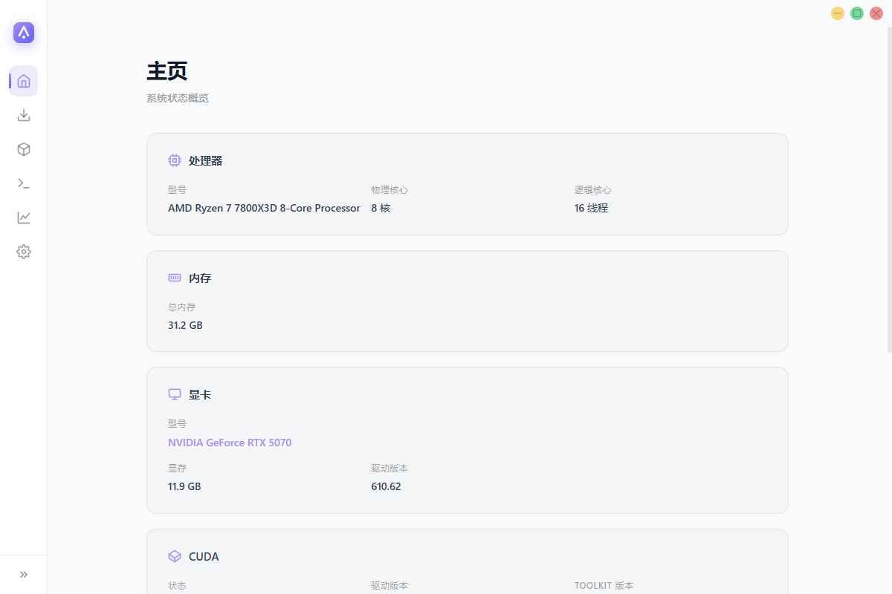
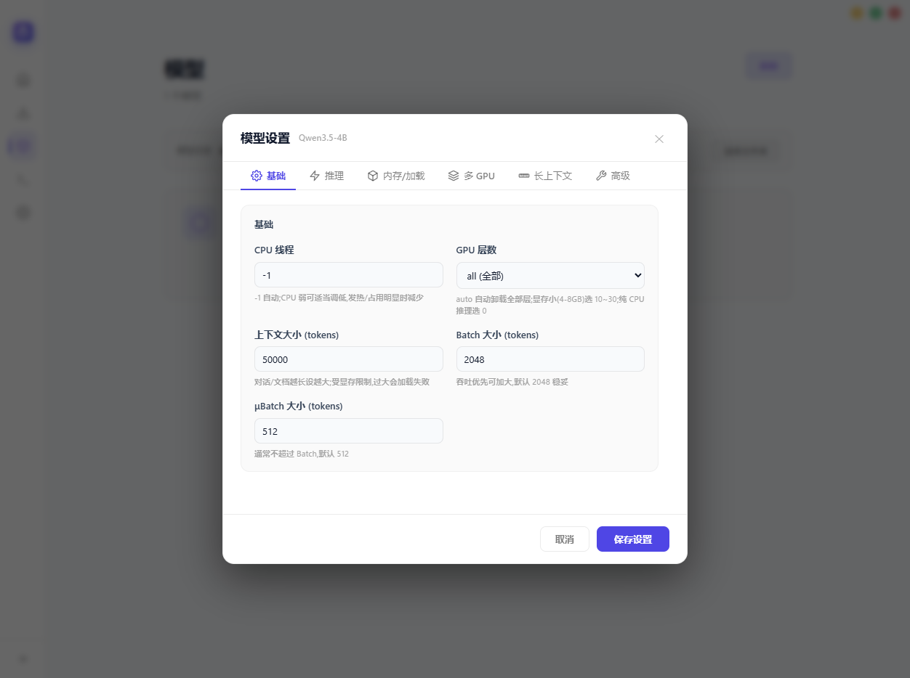
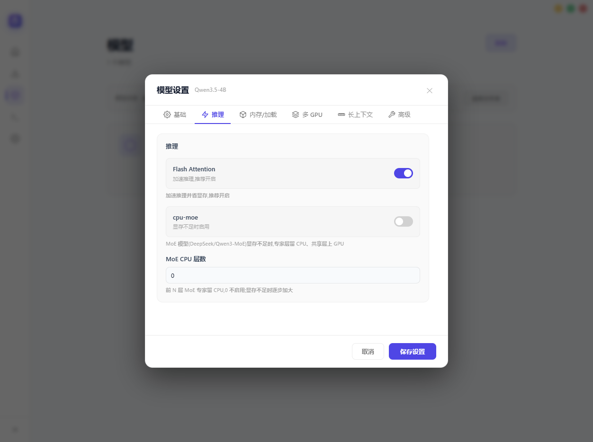
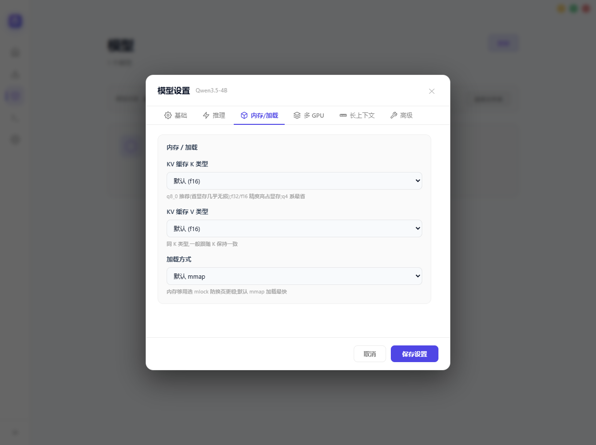
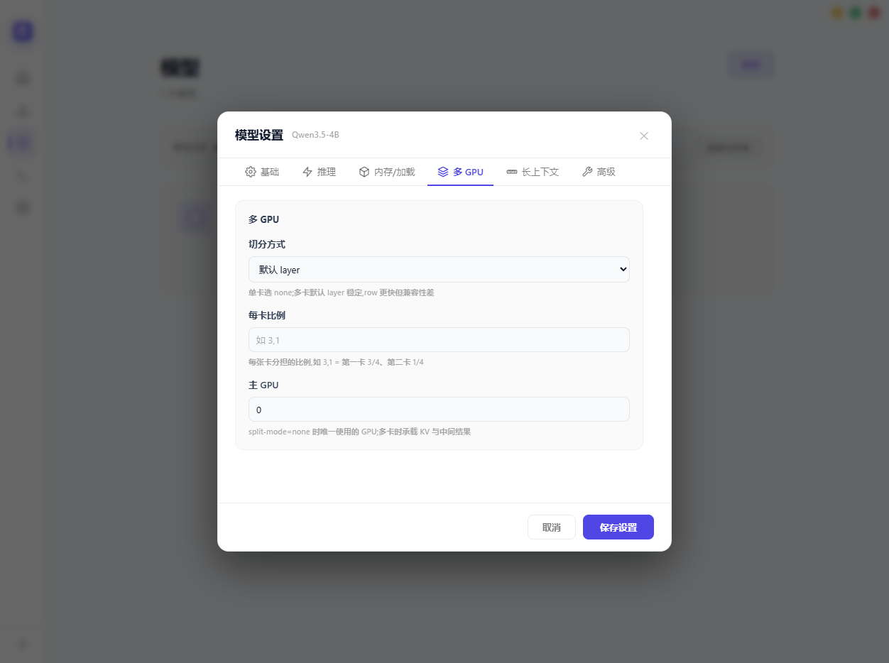
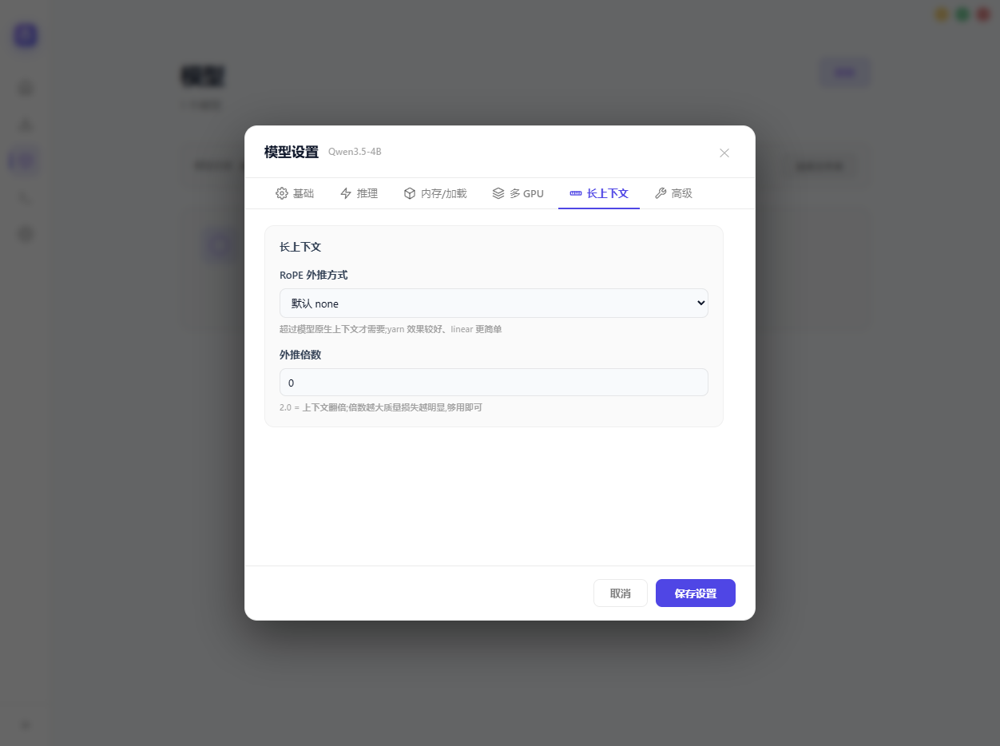
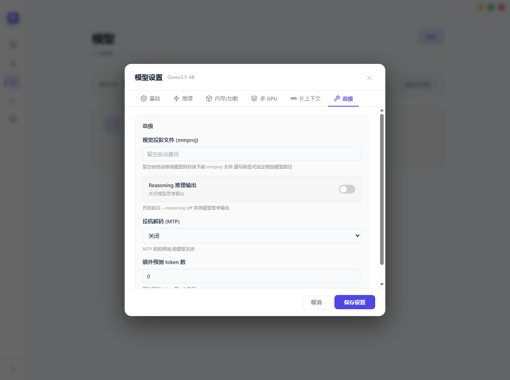
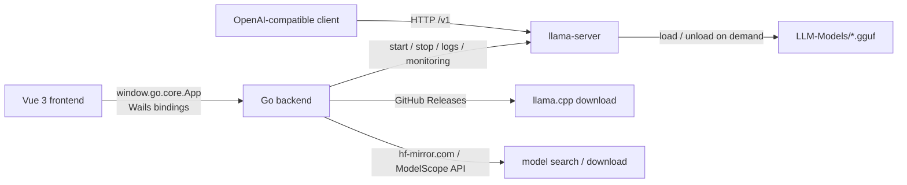

# Llama Desktop


[中文](README.md)

_✨ Run llama.cpp locally on your desktop with one click — OpenAI-compatible API out of the box ✨_

Llama Desktop is a local LLM desktop management tool built on **Wails v2** (Go + WebView2). It brings the entire [llama.cpp](https://github.com/ggml-org/llama.cpp) pipeline — **download → model management → parameter configuration → service startup → API calls → real-time monitoring** — into a single window, so you never have to touch the command line.

## Screenshots

### Collapsible Sidebar

The sidebar can be collapsed to a 64px icon rail (toggle it with the « / » button at the bottom; hovering an icon shows its label as a tooltip). It is collapsed by default, and the preference is persisted to the configuration.



### Home — System Overview

Automatically detects CPU / memory / NVIDIA GPU / CUDA environment and shows the llama.cpp installation status; if not installed, you can download it in one click, or point the app to a custom directory.


### Downloads — Dual-Source Model Search

Search and download models via **HF Mirror (hf-mirror.com) or ModelScope (魔搭)** (HF Mirror is the default; switch in Settings). Search results expand into file lists (sorted by size, with quantization tags detected) and support multi-file batch downloads. Download tasks live in a popup behind the "Download" button (the button badge shows the number of active tasks), with pause / resume / cancel, resumable transfers, live speed display, and a persisted queue that auto-recovers after a restart.


### Models — GGUF Model Management

Scans GGUF files under the `LLM-Models` directory, automatically parsing architecture, quantization level, and file size, and recognizing multimodal models (mmproj) and embedding models. You can switch the model directory via the "Select Folder" button.


### Model Parameter Settings

Configure inference parameters per model in a tabbed dialog (Basic / Inference / Memory & Loading / Multi-GPU / Long Context / Advanced, 6 tabs): CPU threads, GPU layers, context size, Batch / μBatch, MoE CPU layers, KV cache K/V types, loading mode (mlock / mmap), model splitting mode, per-GPU ratio, main GPU, RoPE extrapolation mode and scale, vision projection file (mmproj), speculative decoding (MTP) with extra prediction tokens, and more. Saving writes the settings into a llama-server preset.

**Basic**: CPU threads, GPU layers, context size, Batch / μBatch



**Inference**: Flash Attention, cpu-moe, MoE CPU layers



**Memory & Loading**: KV cache K/V types, loading mode (mmap / mlock / dio)



**Multi-GPU**: model splitting mode, per-GPU ratio, main GPU



**Long Context**: RoPE extrapolation mode and scale



**Advanced**: vision projection file (mmproj), reasoning, speculative decoding (MTP) and extra prediction tokens



### API — Server Control & Real-time Monitoring

The top toolbar offers one-click **Start / Stop / Restart** for llama-server (router mode; buttons enable and disable automatically with the service state). The main area is split into two columns: on the left, a dark **server log console** (live scrolling, clearable); on the right, a **real-time monitoring panel** (refreshed every 1 second) with system monitoring (CPU / memory / disk — the disk card shows the volume holding the models directory), GPU (utilization and VRAM), and token speed (prompt-processing / generation speeds with a 60-second line chart; a placeholder is shown while the service is stopped). Below the main area sit the server configuration (Host / Port, `--models-max`, `--cache-ram`) and the available models list; embedding models are automatically flagged with `embeddings = true` and mmproj files are auto-associated.


### Settings — Theme & Download Source

Switch between dark / light themes with one click; the preference persists automatically. You can also choose the default download source (HF Mirror / ModelScope) and check for updates, which downloads the new version in a dialog so you can finish the update by manually replacing the program files.


### Dark Theme

The app also ships a dark appearance for late-night use.


## Features

1. **Environment detection**: CPU model and core count, memory size, NVIDIA GPU VRAM and driver, CUDA driver / Toolkit versions, and OS information.
2. **One-click llama.cpp install**: Fetches the latest release from GitHub Releases, downloads and extracts it, with resumable transfers and pause / resume / stop; a custom llama.cpp directory can also be specified manually.
3. **Automatic model scanning**: Reads all `.gguf` files under `LLM-Models`, parses model architecture (Qwen2 / Llama / DeepSeek, etc.) and quantization level, and recognizes multimodal (mmproj) and embedding models.
4. **Per-model parameter configuration**: A tabbed dialog (Basic / Inference / Memory & Loading / Multi-GPU / Long Context / Advanced, 6 tabs) covering CPU threads, GPU layers, context size, Batch / μBatch, MoE CPU layers, KV cache K/V types, mlock / mmap loading, model splitting with per-GPU ratio, main GPU, RoPE extrapolation, vision projection file (mmproj), speculative decoding (MTP), etc., persisted per model and written into a llama-server preset.
5. **llama-server router mode**: Start / stop the service with one click, manage multiple concurrently loaded models (`--models-max`) and prompt cache (`--cache-ram`); model presets (INI) are generated automatically, embedding models are flagged with `embeddings = true`, and mmproj files are auto-associated. Real-time monitoring is embedded in the API page — inference service status and uptime, side-by-side prompt-processing / generation speed cards with a line chart, and live CPU / memory / GPU load, refreshed every 1 second.
6. **Dual-source model downloads**: Search model repositories via HF Mirror (hf-mirror.com) or ModelScope (魔搭), expand file lists (sorted by size, quantization tags detected), and batch-download multiple files. Tasks support pause / resume / cancel and resumable transfers; the queue persists and recovers after a restart.
7. **OpenAI-compatible API**: Once the service is up, any OpenAI-compatible client can connect directly (ChatGPT-Next-Web, LobeChat, Open WebUI, etc.).
8. **Self-update**: "Check for Updates" in Settings detects new versions, downloads the update package in a dialog, and you complete the upgrade by manually replacing the program files.
9. **Theme & UI preferences**: Dark / light themes based on CSS variables, with the preference persisted locally; the sidebar can be collapsed to a 64px icon rail (collapsed by default), with the preference persisted as well.

## Tech Stack

| Layer | Technology |
| --- | --- |
| Desktop framework | [Wails v2.14](https://wails.io) (Go 1.25 + WebView2) |
| Backend | Go (stdlib-focused, zero third-party business dependencies) |
| Frontend | Vue 3 + TypeScript + Vite 5 + vue-router (no third-party UI libraries, hand-written CSS-variable themes) |
| Inference engine | [llama.cpp](https://github.com/ggml-org/llama.cpp) (llama-server, router mode) |
| Model sources | Hugging Face Mirror [hf-mirror.com](https://hf-mirror.com) + [ModelScope (魔搭)](https://modelscope.cn) |



## Quick Start

### Prerequisites

- [Go](https://go.dev/dl/) 1.25+
- [Node.js](https://nodejs.org/) 18+ (for building the frontend)
- [Wails CLI](https://wails.io/docs/gettingstarted/installation):

```bash
go install github.com/wailsapp/wails/v2/cmd/wails@latest
```

### Development Mode (hot reload)

```bash
wails dev
```

`wails dev` starts the Go backend and the Vite dev server (`http://localhost:5173`) together. Frontend changes take effect instantly, and the backend recompiles and restarts automatically.

### Production Build

```bash
wails build
```

The artifacts are output to `build/bin/` (`llama-desktop.exe` on Windows).

## Usage Guide

1. **Prepare models**: Put GGUF model files into the `LLM-Models` folder at the project root:

   ```
   LLM-Models/qwen2.5-7b-instruct-q4_k_m.gguf
   ```

   You can also search HF Mirror or ModelScope in the Downloads page and download straight into that directory (HF Mirror is the default; switch the source in Settings).

2. **Install llama.cpp**: On first use, click "Download llama.cpp" on the Home page to install the latest version automatically; if you already have a local build, click "Custom" and point to that directory.

3. **Configure model parameters (optional)**: On the Models page, click the gear icon on a model card to adjust threads, GPU layers, context size, speculative decoding, and more.

4. **Start the service**: Go to the API page, confirm Host / Port (default `127.0.0.1:8080`), and click "Start Service". Once running, you can watch inference speed and system load (CPU / memory / GPU) in the monitoring section at the bottom of the same page.

5. **Connect a client**: Once the service is running, it exposes an OpenAI-compatible endpoint. Configure any client as follows:

   ```bash
   OPENAI_BASE_URL="http://127.0.0.1:8080/v1"
   OPENAI_API_KEY="sk-any-local-value"   # the local service does no auth; a placeholder is enough
   ```

   Set the `model` field to the GGUF file name directly (e.g. `qwen2.5-7b-instruct-q4_k_m.gguf`); llama-server loads / unloads the model automatically.

## Project Structure

```
llama-cpp-desktop/
├── main.go            # Wails entry (window config, asset embedding, core.App binding)
├── core/              # Go backend logic package
│   ├── app.go         # Wails binding methods (config, system info, models, service, downloads, monitor, update)
│   ├── engine.go      # Core logic: environment detection, model scanning, llama.cpp download, preset generation, config persistence
│   ├── bridge.go      # Bridge helpers: service start / stop, download triggering, etc.
│   ├── monitor.go     # Real-time sampling (service status / inference speed / system resources)
│   ├── modelscope.go  # ModelScope (魔搭) model source
│   ├── hidewindow_windows.go   # Hides child-process console windows (Windows)
│   └── *_test.go      # Backend unit tests (config / GGUF / model scanning / presets / downloads / service / monitor, etc.)
├── wails.json         # Wails project config
├── llama-desktop-config.json   # Runtime-persisted config (theme / directories / model params / service config / download source / tasks)
├── LLM-Models/        # Model directory (put .gguf files here)
└── frontend/
    ├── src/
    │   ├── App.vue            # Layout (sidebar + custom title bar)
    │   ├── wails.ts           # Wails backend bridge (window.go.core.App)
    │   ├── store.ts           # Global state (theme / language / tray / sidebar, etc. preferences)
    │   ├── router/            # Routes (hash mode: Home / Downloads / Models / API / Settings)
    │   ├── views/             # Pages: Home / Downloads / Models / Api / Settings
    │   ├── components/        # Sidebar, ModelSettings, UpdateModal
    │   ├── lib/               # Pure-function utilities (formatting, download queue, monitoring, updates, etc.)
    │   ├── __tests__/         # Frontend unit tests (vitest)
    │   └── styles/            # Global styles and CSS-variable themes
    └── wailsjs/              # Auto-generated Wails bindings (do not edit; regenerated at build)
```

## Configuration

Runtime configuration is persisted to `llama-desktop-config.json` at the project root and includes:

- `theme`: theme (`dark` / `light`)
- `language`: UI language (`zh` / `en` / `auto`)
- `trayEnabled`: system tray switch (on by default)
- `sidebarCollapsed`: sidebar collapsed state (collapsed by default)
- `llamaCppDir`: custom llama.cpp directory
- `modelDir`: model directory (defaults to `LLM-Models`)
- `modelConfigs`: per-model inference parameters
- `serverConfig`: service address (`host` / `port`), max concurrently loaded models (`maxModels`), prompt cache size (`cacheRam`, MiB)
- `downloadSource`: default download source (`hf` / `modelscope`)
- `downloadTasks`: download task queue (recovered after a restart)

## FAQ

1. **The Models page says "No models found"?**
   Put `.gguf` files into the `LLM-Models` directory and refresh (re-enter the page or restart the app). Only GGUF files are recognized.

2. **Starting the service on the API page fails?**
   Make sure the llama.cpp status on the Home page is "Installed"; if you use a custom directory, confirm that `llama-server.exe` exists in it. The startup log will print the exact error.

3. **Downloading llama.cpp is slow or fails?**
   The source is GitHub Releases; when the network is restricted you can:
   - manually download and extract the llama.cpp release for your platform, then click "Custom" on the Home page and select that directory;
   - downloads can be paused / resumed at any time and support resumable transfers.

4. **Downloading models is slow?**
   The Downloads page uses the hf-mirror.com mirror by default, which usually works directly on mainland networks. If it is still unsatisfactory, switch the download source to ModelScope (魔搭) in Settings and try again. Multiple files can be downloaded in parallel, with flexible pause / cancel control.

5. **The API page monitoring area shows a speed of 0?**
   When the service is not running or there is no active request, the speed metrics show a placeholder / 0; this is expected. They start refreshing in real time once the service is running and requests are made.

6. **How do I use embedding models?**
   Put embedding models such as bge / all-MiniLM / gte into `LLM-Models`; after starting the service they are automatically flagged as embedding models (`embeddings = true`) and can be called via the `/v1/embeddings` endpoint, e.g. for RAG scenarios.

## Common Dev Commands

```bash
wails dev                  # dev mode (frontend + backend hot reload)
wails build                # production build
cd frontend && npm run build    # build the frontend only
```

## Release

CI (`.github/workflows/ci.yml`) automatically builds and publishes Windows artifacts (installer `llama-desktop-setup-vX.Y.Z-amd64.exe` + portable `llama-desktop-portable-vX.Y.Z-amd64.exe`, where `vX.Y.Z` is the tag version) in these scenarios:

- **Stable release**: pushing a `v*` tag (e.g. `v1.0.0`) automatically creates a full release with change notes;
- **Preview release**: manually running CI from the GitHub Actions page (`workflow_dispatch`) creates a draft release.

```bash
git tag v1.0.0 && git push origin v1.0.0
```

## License

This project is licensed under the [MIT License](LICENSE).
