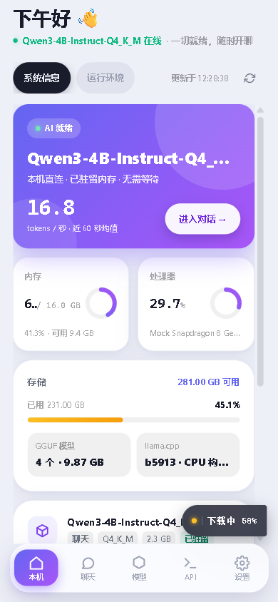
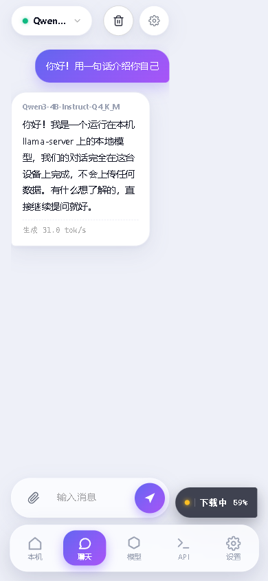
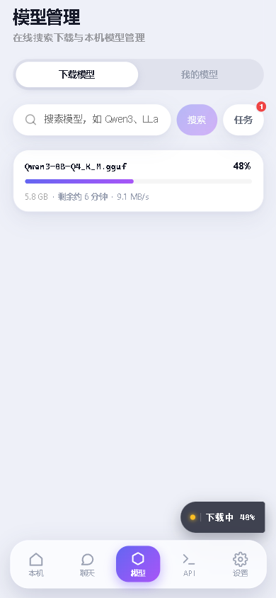
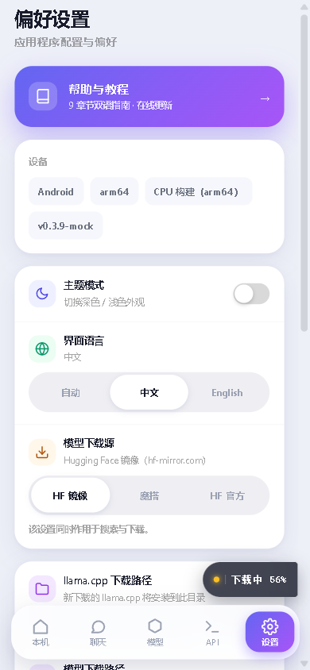
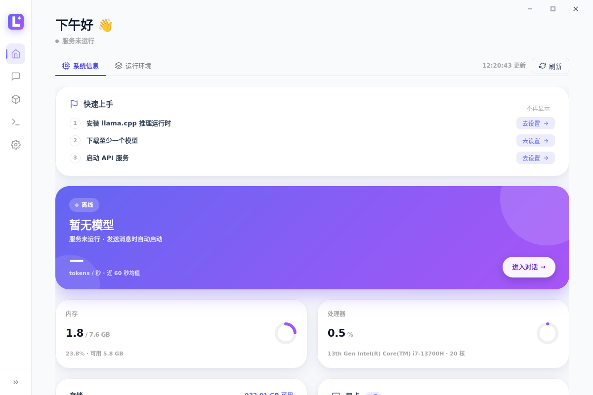
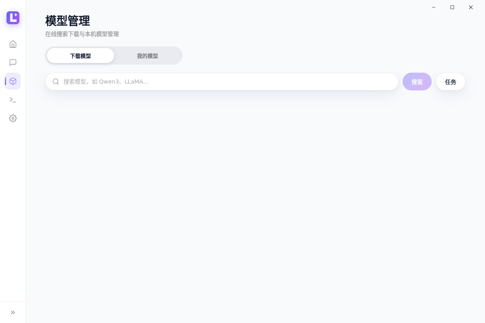
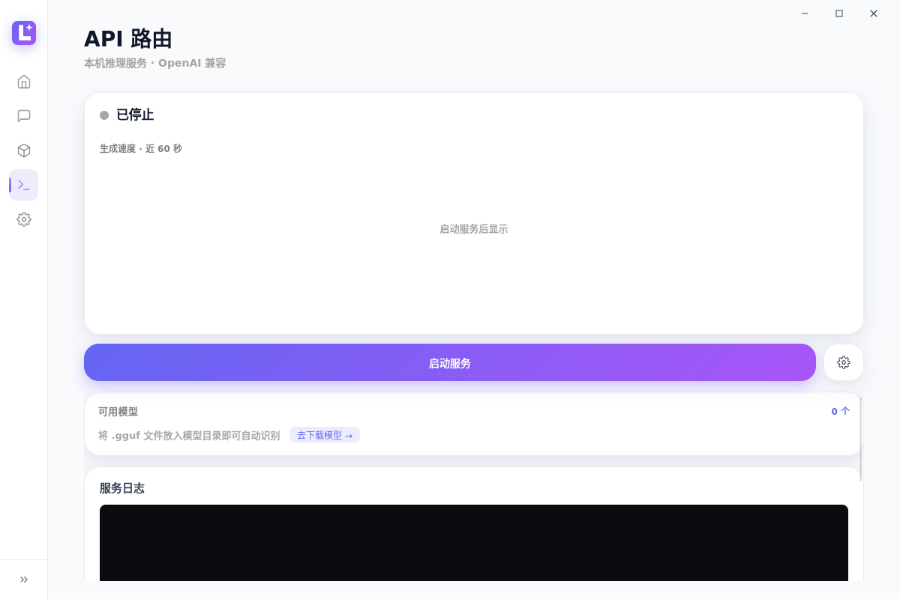
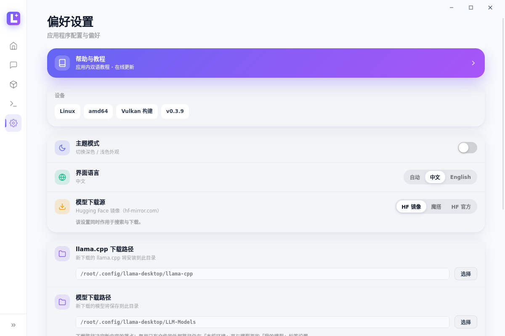
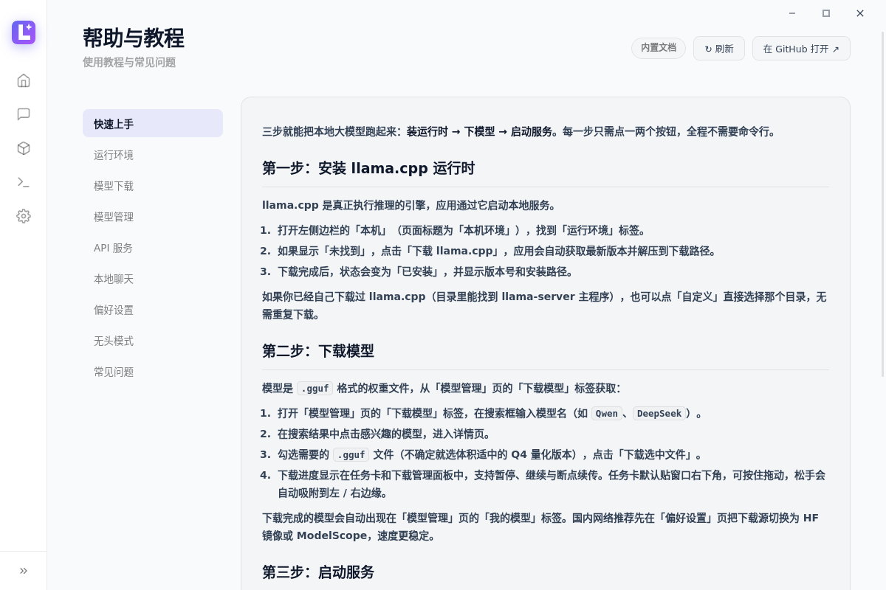
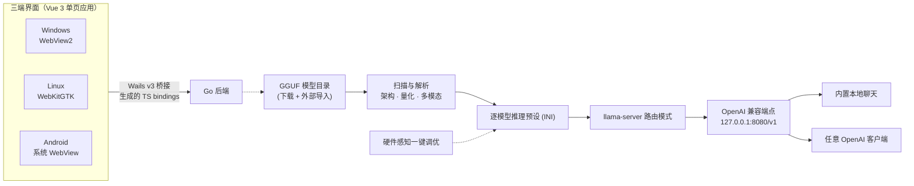

<div align="center">


# Llama Desktop

**本地大模型推理桌面的跨平台图形客户端，基于 [llama.cpp](https://github.com/ggml-org/llama.cpp)**——可视化调优 GGUF 模型，多模型共享一个 OpenAI 兼容端点，内置模型下载、本地聊天与实时监控，一套代码覆盖 Windows / Android / Linux。

Windows x64 · Android arm64 · Linux x64/arm64 · GPL-3.0

[](https://github.com/CodeNeow/llama-cpp-desktop/releases)
[](https://github.com/CodeNeow/llama-cpp-desktop/releases)
[](LICENSE)
[](https://github.com/CodeNeow/llama-cpp-desktop/actions)
[](https://go.dev/dl/)
[](https://wails.io/)
[](https://vuejs.org/)

</div>

[English](README_en.md)

<div align="center">


*本地聊天：流式对话直连本机 llama-server，服务未启动时自动拉起*

</div>

## 🖥️ 跨平台一体的体验

同一套 Go + Vue 3 代码，在三个平台上呈现一致的界面与交互。

**Windows**

| 本机环境 | 模型管理 |
| :---: | :---: |
|  |  |

| API 路由 | 模型设置 |
| :---: | :---: |
|  |  |

**Android**

| 主页 | 聊天 |
| :---: | :---: |
|  |  |

| 模型 | 设置 |
| :---: | :---: |
|  |  |

**Linux**

| 本机环境 | 模型管理 |
| :---: | :---: |
|  |  |

| API 路由 | 偏好设置 |
| :---: | :---: |
|  |  |

<div align="center">

| 帮助与教程 |
| :---: |
|  |

</div>

<div align="center">

右下角的灵动任务卡片：下载进度与已加载模型一键卸载，桌面与手机端体验一致。


</div>

## ✨ 功能亮点

- **一个端点，多个模型** — 以路由器模式运行 llama-server（`--models-dir` / `--models-preset` / `--models-max`），把模型目录下的所有 GGUF 汇聚到一个 OpenAI 兼容 API（默认 `http://127.0.0.1:8080/v1`）。
- **按需加载与一键卸载** — 模型仅在首次被请求时加载进显存 / 内存，无需手动预载；已加载模型在任务卡片中一目了然，空闲即点即卸载释放资源，多模型轮换不用重启服务。
- **一套代码，三端体验** — 同一套 Go + Vue 3 代码运行在 Windows（WebView2）、Linux（WebKitGTK）与 Android（系统 WebView）上；手机档自动切换为底部导航与自适应布局，并适配系统安全区（刘海 / 手势条）。
- **无头 API 路由模式（Windows）** — 一个开关即切换为纯后台运行（Go 后端 + 系统托盘 + llama-server，界面关闭）：GUI ↔ 无头切换时 llama-server 进程平滑交接、推理全程不中断，OpenAI API 持续可用，托盘菜单「显示主窗口」随时回到完整界面。
- **模型 ID 所见即所得** — API 的 `model` 字段就是页面上显示的模型名（如 `Qwen3.6-29B-REAP-Opus-Reasoning-Distill-MTP-Q4_K_M`），从「模型管理」页「我的模型」标签、API 路由页或聊天页复制即可直接使用。
- **硬件感知一键调优** — 读取 GGUF 真实指标（层数、GQA/MLA KV 几何、训练上下文、MoE 专家占比），结合 GPU/CPU/内存快照为每个模型自动规划 GPU 层数、上下文长度、线程与缓存类型。
- **SoC 感知调优（Android）** — 识别骁龙 / 天玑等 SoC 型号与 big.LITTLE 性能核数，在手机上自动限制线程并规划 MoE 专家的 CPU / GPU 分载方案。
- **Android 应用内自更新** — 检查到新版本后直接下载 APK，交由系统 PackageInstaller 会话完成安装，无需手动卸载重装。
- **CUDA 兼容性提示** — 「本机环境」页自动比对显卡算力与已安装的 CUDA 运行时并给出兼容性判定，Blackwell 显卡会明确提示需要 CUDA 12.8+，避免装错运行时。
- **内置本地聊天** — 直连本地端点的流式对话：发送消息即自动拉起本地服务并按需加载所选模型，无需手动启动；切换模型自动卸载前一个。支持 Markdown 渲染、思考过程实时展示，多模态模型支持发送图片，会话级采样参数可调（temperature、top-p / top-k、重复惩罚、最大 token 数、系统提示词）。
- **模型搜索与下载** — 「模型管理」页「下载模型」标签支持 HF 镜像（hf-mirror.com）、Hugging Face 官方与 ModelScope 三源搜索，仓库可展开为文件列表，批量下载走可断点续传的任务队列（暂停 / 继续 / 取消），队列重启后自动恢复。
- **逐模型推理预设** — GPU 层数、KV 缓存类型、长上下文 RoPE、投机解码等参数按模型独立保存，保存后自动写入 llama-server 预设。
- **实时服务监控** — 服务日志控制台与提示词处理 / 生成 Token 速度双指标，每秒刷新，全部固定在视口内无需滚动。
- **灵动任务卡片** — 右下角悬浮的可收起卡片，一眼看清下载进度（llama.cpp / 模型文件 / 应用更新），同时列出当前内存中已加载的模型，每个模型带一键卸载按钮。
- **桌面与移动体验** — Windows 系统托盘、深色 / 浅色主题、界面语言 zh / en / auto；Windows 与 Android 均支持应用内检查更新。
- **内置中英教程** — 「偏好设置」顶部的「帮助与教程」入口进入内置双语教程，内容支持在线更新——无需升级应用即可获取最新文档。

## 🚀 快速开始

### Windows

前往 [Releases 最新版](https://github.com/CodeNeow/llama-cpp-desktop/releases/latest) 下载 `llama-desktop-setup-*-windows-amd64.exe`，双击安装即可（安装包内嵌 WebView2 Runtime 引导器，系统缺失时自动安装）。应用内置自动更新，后续新版本无需手动重装。

环境要求：Windows 10 及以上（x64）。

### Android

前往 [Releases 最新版](https://github.com/CodeNeow/llama-cpp-desktop/releases/latest) 下载 `llama-desktop-*-android-arm64.apk`（arm64 设备，Android 5.0+），安装时按提示允许「安装未知来源应用」。应用内「偏好设置 → 检查更新」可下载新版本并由系统安装器完成升级；应用内自更新要求新旧版本使用同一签名（Release 发布的 APK 均以稳定密钥签名），本地 debug 签名的构建请先卸载旧版再安装。

### Linux

Releases 提供 Ubuntu 22.04 / 24.04 的 `.deb` 包：下载 `llama-desktop_*_amd64.deb` 后安装（`sudo apt install ./llama-desktop_*_amd64.deb`），GTK / WebKit 运行库由包依赖自动解析。其他发行版可参考下节从源码构建。

### 从源码构建

- [Git](https://git-scm.com/)、[Go](https://go.dev/dl/) 1.25+、[Node.js](https://nodejs.org/) 18+
- Wails v3 CLI（与 go.mod 中的 v3 版本一致）：

  ```bash
  go install github.com/wailsapp/wails/v3/cmd/wails3@v3.0.0-beta.16
  ```

- 平台依赖：
  - **Windows**：WebView2 Runtime（Windows 10/11 一般已内置）；
  - **Linux**：GTK4 与 WebKitGTK 6.0 开发包，如 `sudo apt install libgtk-4-dev libwebkitgtk-6.0-dev pkg-config`（Debian/Ubuntu；Releases 中的 `.deb` 使用 `-tags gtk3` 变体构建，对应 GTK3 + WebKit2GTK 4.1）；
  - **Android**：JDK 17 与 Android SDK / NDK（`sdkmanager "ndk;26.3.11579264" "platforms;android-35"`），构建任务详见 [Taskfile.yml](Taskfile.yml) 的 android 段与 [CI 配置](.github/workflows/ci.yml)。

克隆仓库并构建：

```bash
git clone https://github.com/CodeNeow/llama-cpp-desktop.git
cd llama-cpp-desktop
wails3 task build            # Windows / Linux 桌面版
wails3 task android:package  # Android arm64 APK（需先构建前端，输出到 build/bin/）
```

开发模式（Go 后端 + Vite 前端热重载，开发服务器固定在 `http://localhost:5173`）：

```bash
wails3 task dev
```

**首次使用（三端通用）：**

1. 在**本机环境**页的「运行环境」标签点击「下载 llama.cpp」从 GitHub 获取最新版（支持断点续传），也可指定已有的 llama.cpp 目录。
2. 在**模型管理**页的「下载模型」标签搜索 HF 镜像、Hugging Face 或 ModelScope，将 GGUF 文件下载到模型目录（默认 `LLM-Models/`）；进度显示在右下角任务卡片中。
3. 打开**本地聊天**页选择模型，直接发送消息即可开始对话——发送时会自动拉起本地服务并按需加载所选模型，无需手动启动。
4. 需要接入其他 OpenAI 兼容客户端或手动管理服务时，在**API 路由**页点击「启动服务」（默认 `127.0.0.1:8080`）。

## 🧭 使用指南

- **本机环境** — 「系统信息」与「运行环境」两个标签：「系统信息」自动检测 CPU、内存、GPU 与 CUDA 环境并实时采样刷新，给出 Blackwell 显卡与 CUDA 版本的兼容性提示；「运行环境」展示 llama.cpp 安装状态（主程序与 CUDA 运行时组件），支持一键断点续传下载或自定义目录。页面落地标签智能选择：未安装 llama.cpp 时先落在「运行环境」，已安装则落在「系统信息」。
- **本地聊天** — 流式聊天，支持 Markdown 渲染与图片附件；服务未启动时发送消息会自动拉起服务并按需加载所选模型（缺模型 / 缺运行时会有引导提示），切换模型自动卸载前一个，加载 / 卸载变化实时反映在任务卡片中。
- **模型管理** — 「下载模型」标签：三源搜索（HF 镜像 / Hugging Face 官方 / ModelScope，可在偏好设置中切换默认源）、文件级选择、持久化的可断点续传下载队列；「我的模型」标签：扫描模型目录下的 GGUF 文件（解析架构、量化等级，识别多模态 / 嵌入模型），支持硬件感知一键调优；每个模型可进入设置页（基础 / 推理 / 内存 / 多 GPU / 长上下文 / 高级六个标签页）。
- **API 路由** — 启动 / 停止 / 重启 llama-server，查看服务日志与 Token 速度双指标，配置 Port / 最大并发模型数 / Prompt 缓存，并查看当前已加载的模型；访问范围与推理显卡等服务器配置在偏好设置中调整。
- **偏好设置** — 主题、界面语言（zh / en / auto）、下载源、下载与导入目录、服务访问范围与推理显卡等服务器配置、Windows 托盘开关、API 路由模式、检查更新；页内「帮助与教程」入口卡片进入内置教程。

## 🔌 API 接入

服务启动后，任意 OpenAI 兼容客户端均可接入：

```bash
OPENAI_BASE_URL="http://127.0.0.1:8080/v1"
OPENAI_API_KEY="sk-任意占位值"   # 本地服务默认不鉴权；可在偏好设置中配置 API Key
```

`model` 字段直接填页面上显示的模型名（如 `Qwen3.6-29B-REAP-Opus-Reasoning-Distill-MTP-Q4_K_M`），API 路由页的模型标签可直接复制；llama-server 会按需加载 / 卸载模型，内存中的模型也可以在任务卡片中手动卸载。

## ⚙️ 配置

运行时配置持久化在 `llama-desktop-config.json`，存放位置随平台不同（由 `core/paths.go` 统一解析）：

- **Windows**：进程工作目录（通常为安装目录）；
- **Linux**：应用数据目录 `~/.config/llama-desktop/`；
- **Android**：应用私有数据目录（`/data/data/<包名>/files/`）。

主要字段：

| 字段 | 含义 | 默认值 |
| --- | --- | --- |
| `theme` | 主题：`light` / `dark` | `light` |
| `language` | 界面语言：`zh` / `en` / `auto`（auto 跟随系统语言） | `auto` |
| `downloadSource` | 默认下载源：`hf`（HF 镜像）/ `huggingface`（官方）/ `modelscope` | `hf` |
| `trayEnabled` | 系统托盘，关闭窗口最小化到托盘（Windows） | `true` |
| `sidebarCollapsed` | 侧边栏是否默认收起 | `true` |
| `apiRouteMode` | API 路由（无头）模式（Windows）：下次启动后仅以托盘 + llama-server 后台运行，不显示界面 | `false` |
| `serverConfig` | `accessMode`（`local` / `lan`）、`host`、`port`、`maxModels`、`cacheRam`（MiB）、`apiKey`（可选鉴权）、`deviceId`（推理 GPU 绑定） | `127.0.0.1:8080`，`maxModels` 1，`cacheRam` 8192，不鉴权，GPU 自动 |

此外还保存：`llamaCppDownloadDir` / `modelDownloadDir`（下载路径）与 `llamaCppDir` / `modelDir`（外部导入目录）、`modelConfigs`（逐模型推理参数）、`downloadTasks`（下载任务队列，重启后恢复）、`onboardingDismissed`（首页快速开始清单是否已关闭）。

## 🏗️ 架构



前端是 Vue 3 单页应用，经 Wails v3 桥接（构建时生成的 TypeScript bindings）调用 Go 后端；同一套前端分别渲染在 Windows 的 WebView2、Linux 的 WebKitGTK 与 Android 的系统 WebView 中。后端负责扫描模型目录、解析 GGUF 元数据、生成逐模型推理预设并拉起 llama-server。llama-server 以路由模式运行，把目录下所有 GGUF 汇聚成一个 OpenAI 兼容端点，模型按需加载 / 卸载——内置聊天与任意 OpenAI 客户端都接在这同一个端点上。

## 🛠️ 开发

组合质量门禁：

```bash
powershell -NoProfile -ExecutionPolicy Bypass -File .\scripts\check.ps1     # Windows
make check                                                                  # POSIX
```

门禁会运行后端的 `go build` / `go test` / `gofmt` / `golangci-lint` 与前端的 `npm run build`（vue-tsc + vite）；PowerShell 脚本还会运行 vitest 测试套件（`npm test`）。后端测试位于 `core/*_test.go`（标准库 `testing`，含基于真实 llama-server 的服务链路 E2E），前端测试位于 `frontend/src/__tests__/`。开发约定、提交格式与协作流程详见 [AGENTS.md](AGENTS.md) 与 [CONTRIBUTING.md](CONTRIBUTING.md)。

## ❓ 常见问题

**启动时提示应用已在运行。**
应用使用单实例互斥锁，重复启动会被阻止（无头模式 → 界面模式的交接窗口内重试亦被覆盖）。请先关闭正在运行的 Llama Desktop（包括托盘里的后台实例），再重新启动。

**`wails3 task dev` 提示端口被占用。**
Vite 开发服务器绑定 `localhost:5173`（Taskfile 的 `VITE_PORT`，可用 `WAILS_VITE_PORT` 环境变量覆盖）。请结束占用该端口的进程后重试。

**API 路由页「启动」失败，提示找不到模型。**
启动流程会先扫描模型目录并生成预设，目录为空时会报错。请先将 GGUF 文件放入 `LLM-Models/`（可在模型管理页「我的模型」标签确认），然后重试；同时请在「本机环境」页的「运行环境」标签确认 llama.cpp 已安装。

**调用 API 报 `model not found`。**
`model` 字段必须与页面显示的模型名大小写完全一致（服务按精确匹配）。请从 API 路由页的模型标签或模型管理页「我的模型」标签复制粘贴，不要手打。

**单独运行 `npm run dev` 时所有后端调用都失败。**
前端通过 Wails v3 构建时生成的 bindings 调用 Go 后端，脱离 `wails3 task dev` 的 Vite 没有通往后端的桥接层，调用会在请求阶段失败——这是预期行为。调试 UI 请使用 `wails3 task dev`。

**Linux 源码构建报 GTK / WebKit 依赖缺失。**
Wails v3 的 Linux 构建走 cgo：默认路径需要 GTK4 与 WebKitGTK 6.0 开发包（`libgtk-4-dev`、`libwebkitgtk-6.0-dev`），`-tags gtk3` 变体需要 `libgtk-3-dev`、`libwebkit2gtk-4.1-dev`。按所选构建变体用包管理器安装对应开发包与 `pkg-config` 后重新构建。

**Android 无法安装或应用内更新失败。**
安装 APK 需允许「安装未知来源应用」。应用内自更新要求设备上已安装的版本与新 APK 使用同一签名——Release 发布的 APK 使用稳定签名密钥，本地 debug 签名或其他来源的构建无法互相覆盖升级；签名不一致时请先卸载旧版再安装。本应用为侧载分发（不上架应用商店），更新包始终从 GitHub Releases 获取。

**下载 llama.cpp 很慢或失败。**
下载源为 GitHub Releases，支持暂停 / 继续与断点续传。网络受限时可手动下载对应平台的发行包并解压，然后在「本机环境」页的「运行环境」标签通过「自定义」选择该目录。

## 📄 协议

Copyright © 2026 [CodeNeow](https://github.com/CodeNeow/llama-cpp-desktop)

本项目基于 [GNU General Public License v3](LICENSE) 开源。
