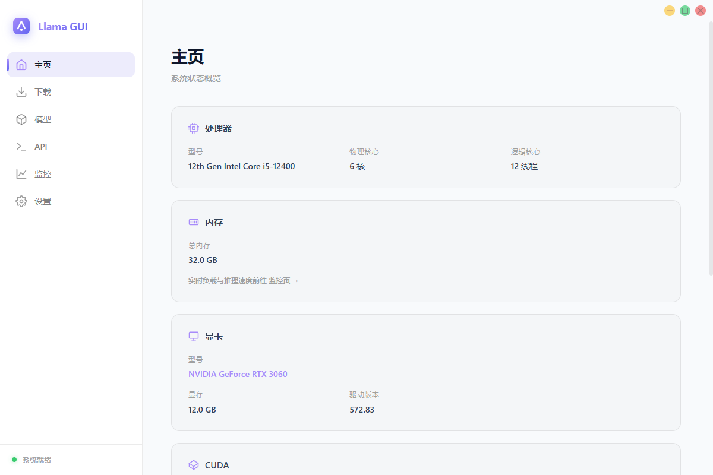
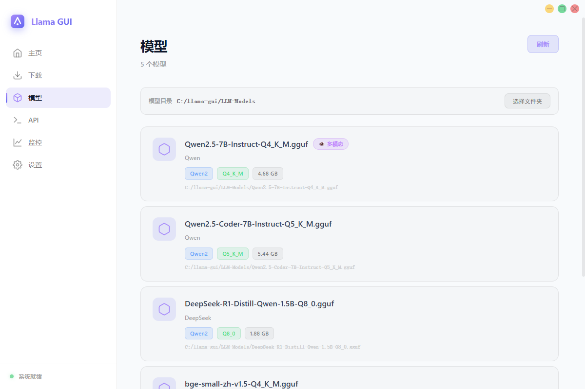
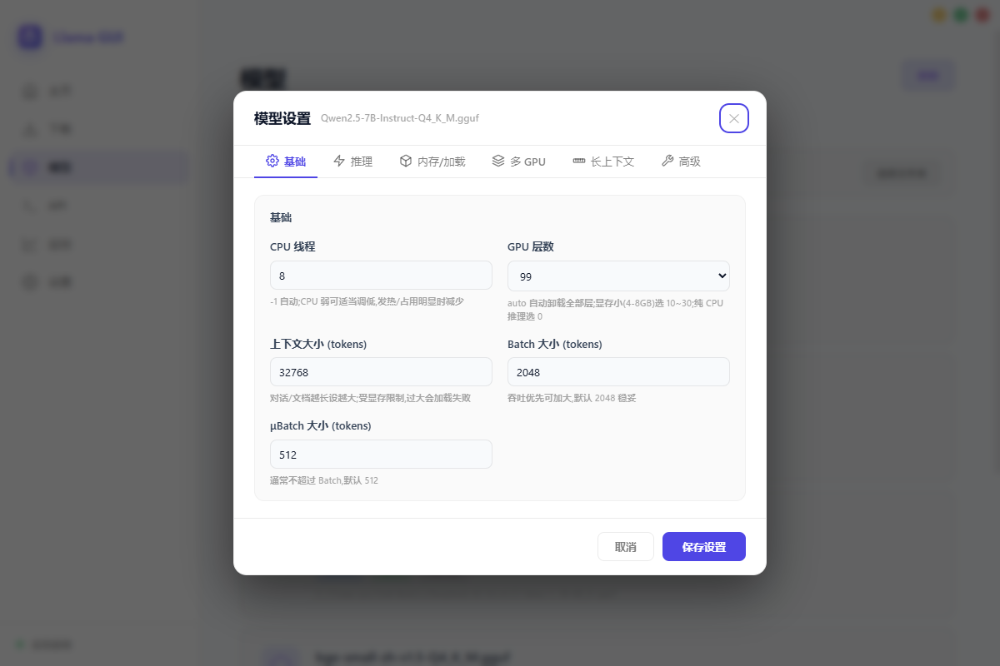
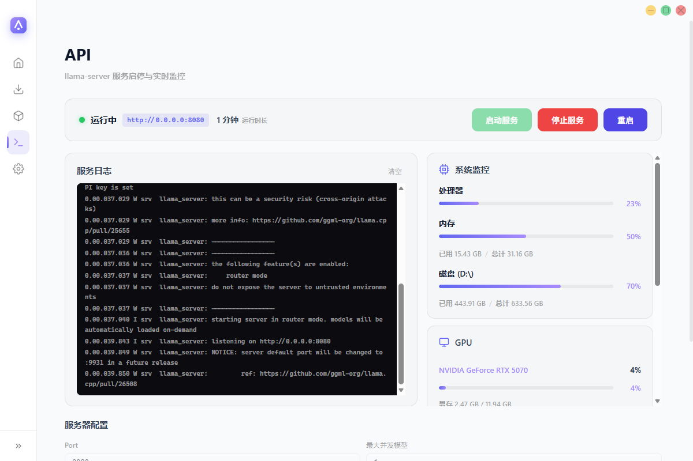
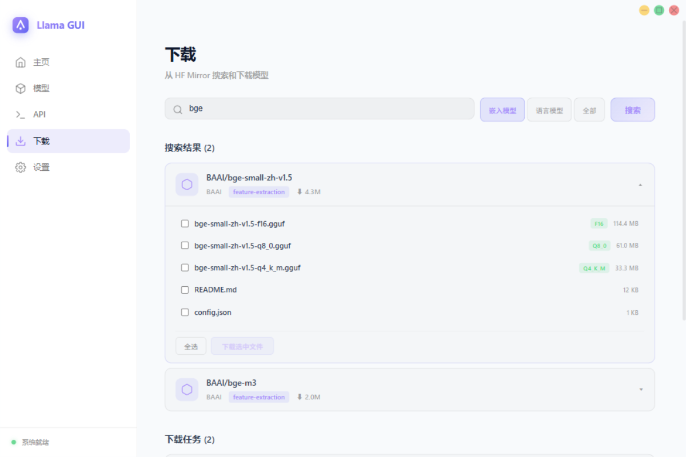
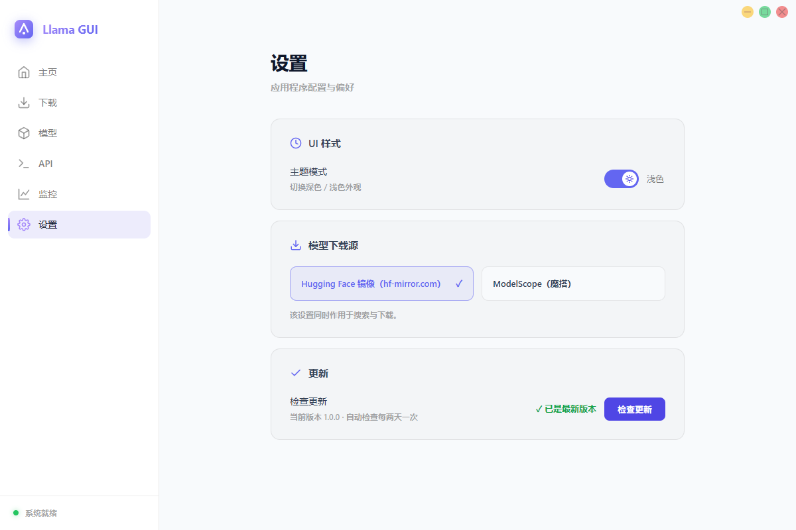
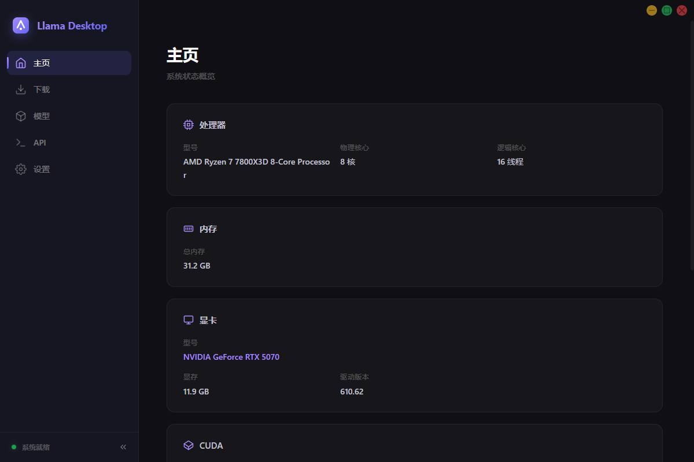
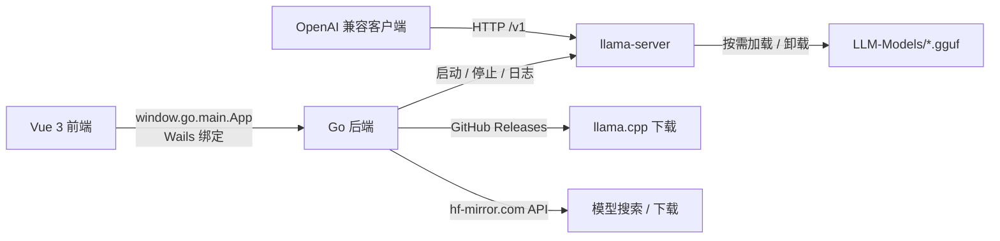

# Llama GUI


_✨ 在本地桌面一键运行 llama.cpp，OpenAI 兼容 API 开箱即用 ✨_

Llama GUI 是一个基于 **Wails v2**（Go + WebView）构建的本地大模型桌面管理工具。它帮你把 [llama.cpp](https://github.com/ggml-org/llama.cpp) 的完整链路（**下载 → 模型管理 → 参数配置 → 服务启动 → API 调用**）收敛到一个窗口里，无需手动敲命令行。

## 界面预览

### 主页 — 系统状态概览

自动检测 CPU / 内存 / NVIDIA 显卡 / CUDA 环境，展示 llama.cpp 安装状态；未安装时可在应用内一键下载。



### 模型 — GGUF 模型管理

扫描 `LLM-Models` 目录下的 GGUF 文件，自动解析架构、量化等级、文件大小，并识别多模态模型（mmproj）。



### 模型参数设置

为每个模型独立配置推理参数：线程数、GPU 层数、上下文大小、Flash Attention、KV 缓存类型等，保存后自动写入 llama-server 预设。



### API — llama-server 路由器模式

一键启动 / 停止 llama-server（路由器模式），多模型按需自动加载与卸载；内置实时服务日志。



### 下载 — HF Mirror 模型搜索

通过 [HF Mirror](https://hf-mirror.com) 搜索并下载模型，支持多文件选择、暂停 / 继续 / 取消。



### 设置 — 主题切换

深色 / 浅色主题一键切换，偏好自动持久化。



### 深色主题

应用同样支持深色外观，满足夜间使用场景。



## 功能

1. **环境检测**：CPU 型号与核心数、内存容量、NVIDIA GPU 显存与驱动、CUDA 驱动 / Toolkit 版本、操作系统信息。
2. **llama.cpp 一键安装**：从 GitHub Releases 自动获取最新版并下载解压，支持断点续传、暂停 / 恢复 / 停止；也可手动指定自定义 llama.cpp 目录。
3. **模型自动扫描**：读取 `LLM-Models` 目录下所有 `.gguf` 文件，解析模型架构（Qwen2 / Llama / DeepSeek 等）与量化等级，支持多模态（mmproj）识别。
4. **逐模型参数配置**：CPU 线程（`-t`）、GPU 层数（`-ngl`）、上下文大小（`-c`）、Batch / μBatch（`-b` / `-ub`）、Flash Attention（`-fa`）、KV 缓存 K/V 类型、mlock、no-mmap，按模型持久化保存。
5. **llama-server 路由器模式**：一键启动 / 停止服务，多模型并发管理（`--models-max`）、Prompt 缓存（`--cache-ram`）、连续批处理（`--cont-batching`）；自动生成模型预设（INI），嵌入模型自动标记 `embeddings = true`，mmproj 自动关联。
6. **模型下载**：从 HF Mirror 搜索模型仓库，展开查看文件列表（按大小排序、自动识别量化标签），可勾选多个文件批量下载。
7. **OpenAI 兼容 API**：服务启动后可直接对接任意 OpenAI 兼容客户端（ChatGPT-Next-Web、LobeChat、Open WebUI 等）。
8. **主题系统**：深色 / 浅色主题，基于 CSS 变量，偏好持久化到本地配置。

## 技术栈

| 层 | 技术 |
| --- | --- |
| 桌面框架 | [Wails v2](https://wails.io)（Go 1.22 + WebView2） |
| 后端 | Go（标准库为主，零第三方业务依赖） |
| 前端 | Vue 3 + TypeScript + Vite 5 + vue-router（无第三方 UI 库，手写 CSS 变量主题） |
| 推理引擎 | [llama.cpp](https://github.com/ggml-org/llama.cpp)（llama-server，路由器模式） |
| 模型源 | Hugging Face 镜像 [hf-mirror.com](https://hf-mirror.com) |



## 快速开始

### 环境要求

- [Go](https://go.dev/dl/) 1.22+
- [Node.js](https://nodejs.org/) 18+（构建前端）
- [Wails CLI](https://wails.io/docs/gettingstarted/installation)：

```bash
go install github.com/wailsapp/wails/v2/cmd/wails@latest
```

### 开发模式（热重载）

```bash
wails dev
```

`wails dev` 会同时启动 Go 后端与 Vite 前端开发服务器（`http://localhost:5173`），前端改动即时生效，后端重新编译自动重启。

### 生产构建

```bash
wails build
```

产物输出到 `build/bin/`（Windows 下为 `llama-gui.exe`）。

## 使用指南

1. **准备模型**：将 GGUF 模型文件放入项目根目录的 `LLM-Models` 文件夹：

   ```
   LLM-Models/qwen2.5-7b-instruct-q4_k_m.gguf
   ```

   也可以在「下载」页从 HF Mirror 搜索并直接下载到该目录。

2. **安装 llama.cpp**：首次使用在「主页」点击「下载 llama.cpp」自动安装最新版；若已有本地编译版本，点击「自定义」指定目录即可。

3. **配置模型参数（可选）**：在「模型」页点击模型卡片右上角的齿轮，按需调整线程、GPU 层数、上下文大小等。

4. **启动服务**：进入「API」页，确认 Host / Port（默认 `127.0.0.1:8080`），点击「启动服务」。

5. **接入客户端**：服务启动后即提供 OpenAI 兼容端点，任意客户端按如下方式配置：

   ```bash
   OPENAI_BASE_URL="http://127.0.0.1:8080/v1"
   OPENAI_API_KEY="sk-本地任意值"   # 本地服务不做鉴权，仅需占位
   ```

   `model` 字段直接填 GGUF 文件名（如 `qwen2.5-7b-instruct-q4_k_m.gguf`），llama-server 会自动加载 / 卸载模型。

## 项目结构

```
llama-cpp-gui/
├── main.go            # Wails 应用入口（窗口配置、资源嵌入）
├── app.go             # Wails 绑定方法（配置、系统信息、模型、服务、下载）
├── engine.go          # 核心逻辑：环境检测、模型扫描、llama.cpp 下载、HF Mirror 搜索、配置持久化
├── bridge.go          # 服务启停、下载触发等桥接辅助
├── wails.json         # Wails 项目配置
├── llama-gui-config.json   # 运行时持久化配置（主题 / 模型参数 / 服务配置）
├── LLM-Models/        # 模型目录（放入 .gguf 文件）
└── frontend/
    ├── src/
    │   ├── App.vue            # 布局（侧边栏 + 自定义标题栏）
    │   ├── wails.ts           # Wails 后端桥接层（window.go.main.App）
    │   ├── store.ts           # 全局状态（主题）
    │   ├── router/            # 路由（hash 模式）
    │   ├── views/             # 页面：Home / Models / Api / Downloads / Settings
    │   ├── components/        # Sidebar、ModelSettings
    │   └── styles/            # 全局样式与 CSS 变量主题
    └── wailsjs/              # Wails 生成的绑定（勿手改，构建时自动生成）
```

## 配置

运行时配置持久化在项目根目录的 `llama-gui-config.json`，包含：

- `theme`：主题（`dark` / `light`）
- `llamaCppDir`：自定义 llama.cpp 目录
- `modelConfigs`：逐模型的推理参数
- `serverConfig`：服务地址（`host` / `port`）、最大并发模型数（`maxModels`）、Prompt 缓存大小（`cacheRam`，MiB）

## 常见问题

1. **「模型」页显示"暂无模型"？**
   将 `.gguf` 文件放入 `LLM-Models` 目录后点击刷新（重新进入页面或重启应用）。目录下只识别 GGUF 格式文件。

2. **「API」页启动失败？**
   在「主页」确认 llama.cpp 状态为「已安装」；若使用自定义目录，请确认目录中存在 `llama-server.exe`。启动日志会输出具体错误原因。

3. **下载 llama.cpp 很慢或失败？**
   下载源为 GitHub Releases，网络受限时可：
   - 手动下载对应平台的 llama.cpp 发行包并解压，然后在「主页」点击「自定义」选择该目录；
   - 下载中断可随时「暂停 / 继续」，支持断点续传。

4. **下载模型很慢？**
   「下载」页默认走 hf-mirror.com 镜像源，国内网络通常可直接使用；多文件可并行下载，暂停 / 取消灵活控制。

5. **如何使用嵌入模型（Embedding）？**
   将 bge / all-MiniLM / gte 等嵌入模型放入 `LLM-Models`，启动服务后自动标记为嵌入模型（`embeddings = true`），通过 `/v1/embeddings` 接口调用，可直接用于 RAG 场景。

## 常见开发命令

```bash
wails dev                  # 开发模式（前后端热重载）
wails build                # 生产构建
cd frontend && npm run build    # 仅构建前端
```
