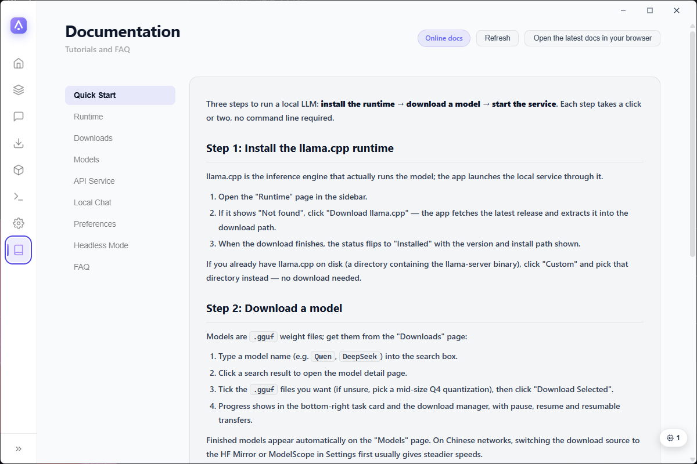
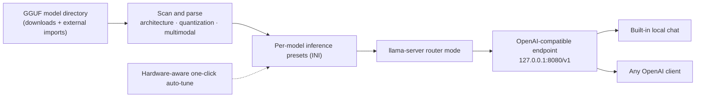

<div align="center">


# Llama Desktop

**Local LLM inference desktop — a friendly GUI client for [llama.cpp](https://github.com/ggml-org/llama.cpp)**: visually tune GGUF models, serve many models behind one OpenAI-compatible endpoint, with built-in model downloads, local chat, and real-time monitoring.

Built with Wails v2 (Go backend + Vue 3 frontend) · Windows x64 · GPL-3.0

[](https://github.com/CodeNeow/llama-cpp-desktop/releases)
[](LICENSE)
[](https://github.com/CodeNeow/llama-cpp-desktop/releases)
[](https://github.com/CodeNeow/llama-cpp-desktop/releases)
[](https://github.com/CodeNeow/llama-cpp-desktop/actions)
[](https://go.dev/dl/)
[](https://wails.io/)

</div>

[简体中文](README.md)


## ✨ Highlights

- **One endpoint, many models** — runs llama-server in router mode (`--models-dir` / `--models-preset` / `--models-max`), serving every GGUF in your models directory over a single OpenAI-compatible API (default `http://127.0.0.1:8080/v1`).
- **On-demand loading & one-click unload** — models load into VRAM / memory only when first requested, no manual preloading; loaded models are listed in the task dock, each with a one-click unload button, so switching models never requires restarting the service.
- **Headless API-route mode** — one toggle restarts the app as a background-only process (Go backend + system tray + llama-server, no GUI): the WebView2 renderer that costs hundreds of MB of memory in GUI mode exits entirely, leaving only a ~20 MB background process; inference keeps running without interruption, the OpenAI API stays available, and the tray menu's "Show Main Window" brings the full UI back anytime.
- **Copy-paste model IDs** — the API `model` field is exactly the name shown in the UI (e.g. `Qwen3.6-29B-REAP-Opus-Reasoning-Distill-MTP-Q4_K_M`); copy it from the "My Models" tab of the Models page, the API Router or the Chat page and it just works.
- **Hardware-aware auto-tune** — reads real GGUF metrics (block count, GQA/MLA KV geometry, trained context, MoE expert ratio) and snapshots GPU/CPU/RAM to plan GPU layers, context length, threads and cache types per model in one click.
- **CUDA compatibility guidance** — the System Environment page compares GPU compute capability against the installed CUDA runtime and states the verdict outright; Blackwell cards are told they need CUDA 12.8+, so you never chase a mismatched runtime.
- **Built-in chat** — streaming conversations straight to the local endpoint: sending a message auto-starts the local service and loads the selected model on demand, no manual start; switching models unloads the previous one automatically. Markdown rendering, a live reasoning view, image attachments for multimodal models, and per-session sampling controls (temperature, top-p / top-k, repeat penalty, max tokens, system prompt).
- **Model discovery and downloads** — the "Download" tab of the Models page searches HF Mirror (hf-mirror.com) or ModelScope, expands repositories into file lists, and batch-downloads through a resumable queue (pause / resume / cancel) that survives restarts.
- **Per-model inference presets** — GPU layers, KV cache types, long-context RoPE settings, speculative decoding and more, persisted per model and written into the llama-server preset on save.
- **Live service monitor** — server log console plus prompt-processing / generation token-speed metrics, refreshed every second — all pinned in the viewport, no page scrolling.
- **Task dock** — a collapsible card floating at the bottom-right corner shows download progress at a glance (llama.cpp / model files / app updates) alongside the models currently loaded in memory, each with a one-click unload button.
- **Desktop niceties** — Windows system tray, in-app update check, light / dark themes, and a zh / en / auto UI language.
- **Built-in bilingual docs** — the Docs page ships a full zh / en tutorial whose content updates online — fresh documentation without upgrading the app.

## 📸 Screenshots

| System Environment | Local Chat |
| :---: | :---: |
|  |  |
|  |  |
|  |  |

<div align="center">

The floating task dock at the bottom-right corner: download progress plus one-click unload for in-memory models.


</div>

## 🚀 Getting Started

### Option 1: Download the installer (recommended)

Grab `llama-desktop-setup-*.exe` from the [latest release](https://github.com/CodeNeow/llama-cpp-desktop/releases/latest) and double-click to install; the app updates itself, so later versions need no manual reinstall.

Requirements: Windows 10 or later (x64 only); WebView2 is installed automatically with the app.

### Option 2: Build from source

- [Git](https://git-scm.com/), [Go](https://go.dev/dl/) 1.25+, [Node.js](https://nodejs.org/) 18+
- Wails CLI v2.14+:

  ```bash
  go install github.com/wailsapp/wails/v2/cmd/wails@latest
  ```

Clone the repository and start dev mode:

```bash
git clone https://github.com/CodeNeow/llama-cpp-desktop.git
cd llama-cpp-desktop
wails dev
```

`wails dev` starts the Go backend and the Vite dev server (`http://localhost:5173`) together, with hot reload on both sides.

**First steps (same for both options):**

1. On **System Environment**, in the "Runtime Environment" tab, click "Download llama.cpp" to fetch the latest release from GitHub (resumable), or point the app at an existing llama.cpp directory.
2. On the **Models** page's "Download" tab, search HF Mirror or ModelScope and download a GGUF file into the models directory (`LLM-Models/` by default); progress shows up in the task dock at the bottom-right corner.
3. Open **Local Chat**, pick the model, and just send a message — sending auto-starts the local service and loads the selected model on demand, no manual start needed.
4. To connect other OpenAI-compatible clients or manage the service by hand, click "Start Server" on the **API Router** page (default `127.0.0.1:8080`).

## 🧭 Usage

- **System Environment** — detects CPU, memory, GPU and CUDA with live samples, and flags CUDA compatibility for Blackwell GPUs; the "Runtime Environment" tab shows the llama.cpp installation status (main program and CUDA runtime components) with one-click resumable download or a custom directory.
- **Local Chat** — streaming chat with markdown rendering and image attachments; when the service is stopped, sending a message auto-starts it and loads the selected model on demand (guided prompts when models or the runtime are missing), switching models unloads the previous one, and load / unload changes show up in the task dock in real time.
- **Models** — the "Download" tab: dual-source search (HF Mirror / ModelScope, switchable in Preferences), file-level selection and a persistent, resumable download queue; the "My Models" tab: scans the models directory for GGUF files (architecture, quantization, multimodal / embedding detection) with one-click hardware-aware auto-tune; each model links to its settings page (basic / inference / memory / multi-GPU / long-context / advanced tabs).
- **API Router** — start / stop / restart llama-server, watch the server log and dual token-speed metrics, edit the port / max concurrent models / prompt cache, and see which models are currently loaded; the access scope and inference GPU are configured under Preferences.
- **Preferences** — theme, UI language (zh / en / auto), download source, download & import directories, server options such as access scope and the inference GPU, Windows tray toggle, API-route mode, and check for updates.
- **Docs** — a built-in zh / en tutorial whose content updates online automatically.

Once the service is running, any OpenAI-compatible client can connect:

```bash
OPENAI_BASE_URL="http://127.0.0.1:8080/v1"
OPENAI_API_KEY="sk-any-placeholder"   # no auth by default; an optional API key can be set in Preferences
```

Set `model` to the name shown in the UI (for example `Qwen3.6-29B-REAP-Opus-Reasoning-Distill-MTP-Q4_K_M`) — the tags on the API Router page are copy-paste ready; llama-server loads and unloads models on demand. In-memory models can also be unloaded from the task dock.

## ⚙️ Configuration

Runtime settings are persisted to `llama-desktop-config.json` in the project root. Key fields:

| Field | Meaning | Default |
| --- | --- | --- |
| `theme` | UI theme: `light` / `dark` | `light` |
| `language` | UI language: `zh` / `en` / `auto` (auto follows the OS locale) | `auto` |
| `downloadSource` | Default model source: `hf` / `modelscope` | `hf` |
| `trayEnabled` | Windows system tray (show / quit menu) | `true` |
| `sidebarCollapsed` | Whether the sidebar starts collapsed | `true` |
| `apiRouteMode` | API-route (headless) mode: on the next start the app runs as tray + llama-server only, no GUI | `false` |
| `serverConfig` | `accessMode` (`local` / `lan`), `host`, `port`, `maxModels`, `cacheRam` (MiB) | `127.0.0.1:8080`, `maxModels` 1, `cacheRam` 8192 |

Also stored: `llamaCppDownloadDir` / `modelDownloadDir` (download paths) and `llamaCppDir` / `modelDir` (imported external directories), `modelConfigs` (per-model inference parameters) and `downloadTasks` (the download queue, recovered on restart).

## 🏗️ Architecture



The frontend is a Vue 3 single-page app that talks to the Go backend through the Wails bridge; the backend scans the model directories, parses GGUF metadata, generates per-model inference presets and launches llama-server. Running in router mode, llama-server serves every GGUF in the directory behind one OpenAI-compatible endpoint, loading and unloading models on demand — the built-in chat and any OpenAI client connect to that same endpoint.

## 🛠️ Development

Combined quality gate:

```bash
powershell -NoProfile -ExecutionPolicy Bypass -File .\scripts\check.ps1     # Windows
make check                                                                  # POSIX
```

The gate runs `go build` / `go test` / `gofmt` / `golangci-lint` on the backend and `npm run build` (vue-tsc + vite) on the frontend; the PowerShell script also runs the vitest suite (`npm test`). Backend tests live in `core/*_test.go` (standard library `testing`), frontend tests in `frontend/src/__tests__/`. See [AGENTS.md](AGENTS.md) and [CONTRIBUTING.md](CONTRIBUTING.md) for conventions, commit format and the collaboration workflow.

## 📦 Building

```bash
wails build
```

The production binary is written to `build/bin/llama-desktop.exe`. The frontend is embedded into the binary via `go:embed`; `wails build` compiles it automatically.

## ❓ FAQ

**`wails dev` reports the port is already in use.**
The Vite dev server binds `localhost:5173` (see `frontend:dev:serverUrl` in `wails.json`). End the process occupying it and retry.

**`wails dev` flashes a window and exits with "already running".**
The app enforces a single-instance mutex. Close any running Llama Desktop first (including the installed copy and tray-only background instances), then start dev mode again.

**"Start" on the API Router page fails with "no models found".**
Startup scans the models directory and generates presets first, so an empty directory is an error. Put GGUF files into `LLM-Models/` (check the "My Models" tab of the Models page) and try again. Also confirm llama.cpp is installed, as shown in the "Runtime Environment" tab of the System Environment page.

**API calls fail with `model not found`.**
The `model` field must match the name shown in the UI exactly (the service matches case-sensitively). Copy-paste from the API Router model tags or the "My Models" tab of the Models page instead of typing it by hand.

**Every backend call throws when running the frontend with `npm run dev` standalone.**
`window.go` is injected by the Wails runtime, so Vite without `wails dev` has no bridge to the Go backend — this is expected. Use `wails dev` to debug the UI with the backend attached.

**Downloading llama.cpp is slow or fails.**
The download comes from GitHub Releases; it supports pause / resume with resumable transfers. On a restricted network, download the Windows release manually, extract it, and select the directory via "Custom" in the "Runtime Environment" tab of the System Environment page.

## 📄 License

Copyright © 2026 [CodeNeow](https://github.com/CodeNeow/llama-cpp-desktop)

This project is licensed under the [GNU General Public License v3](LICENSE).
