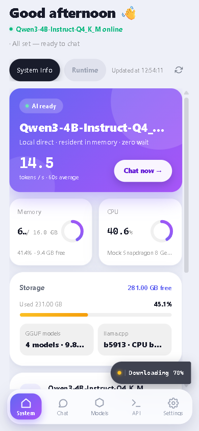
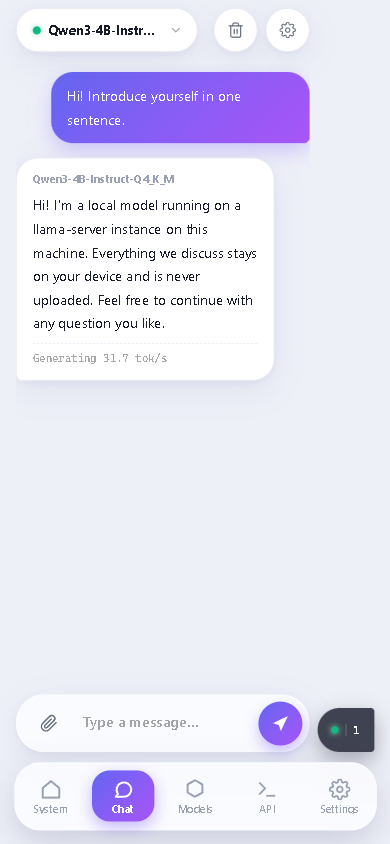
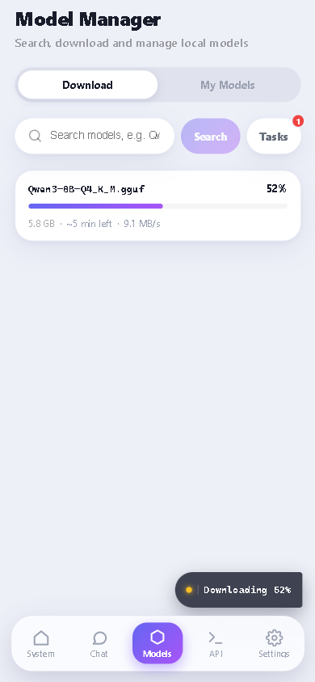
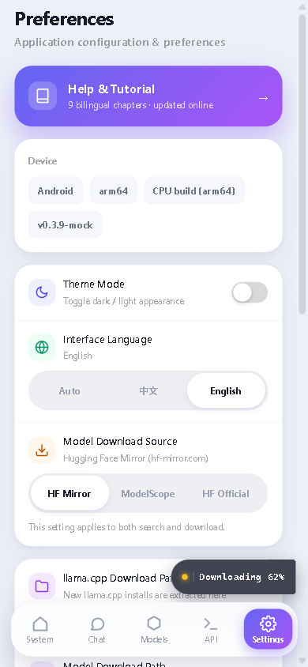
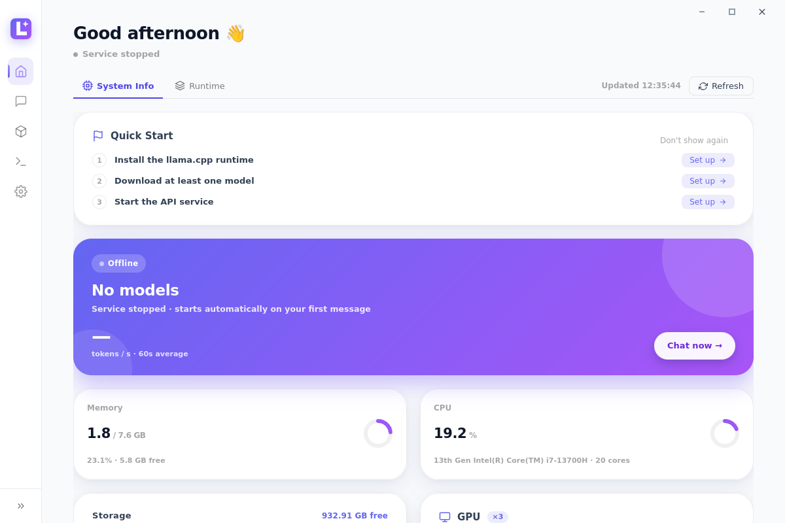
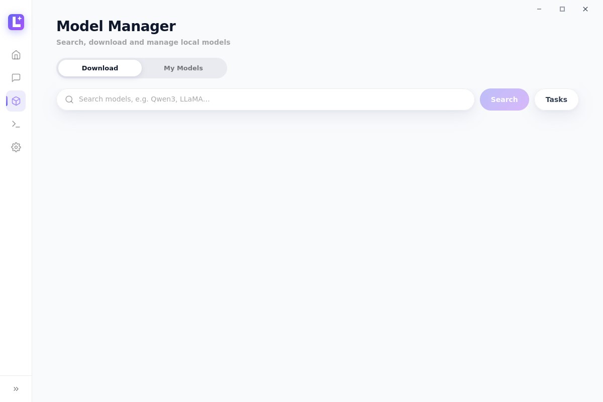
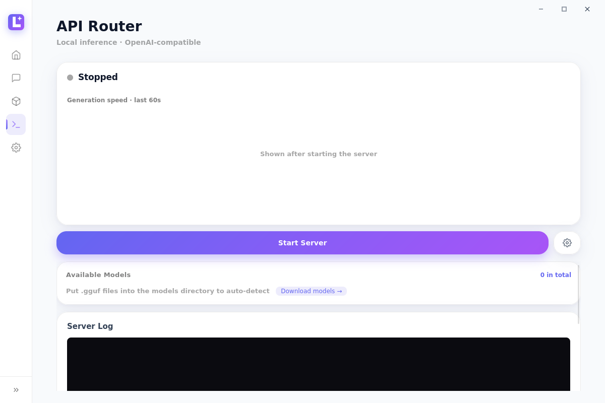
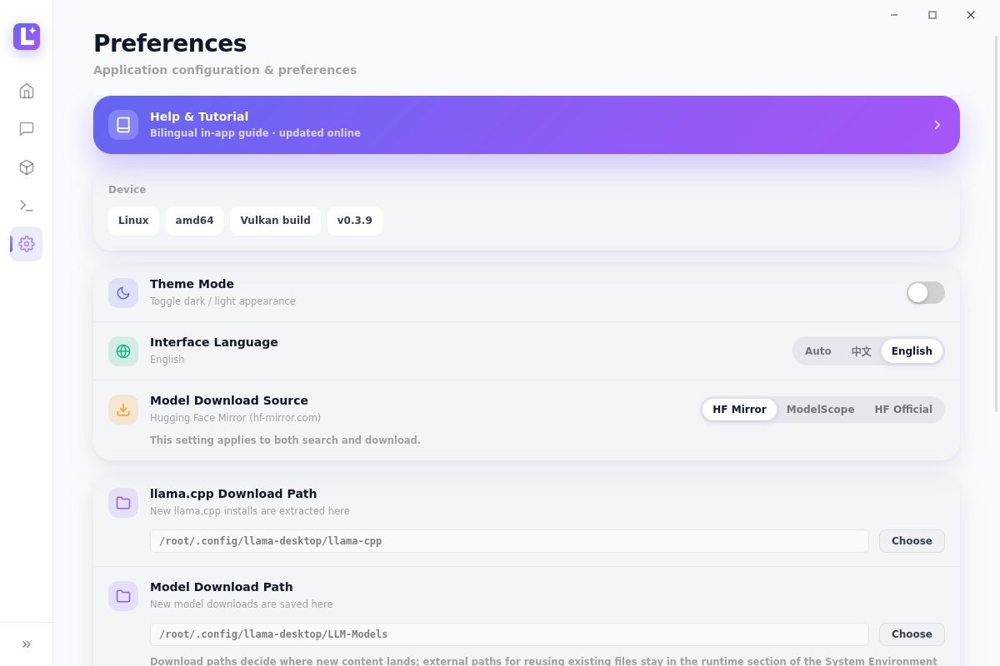
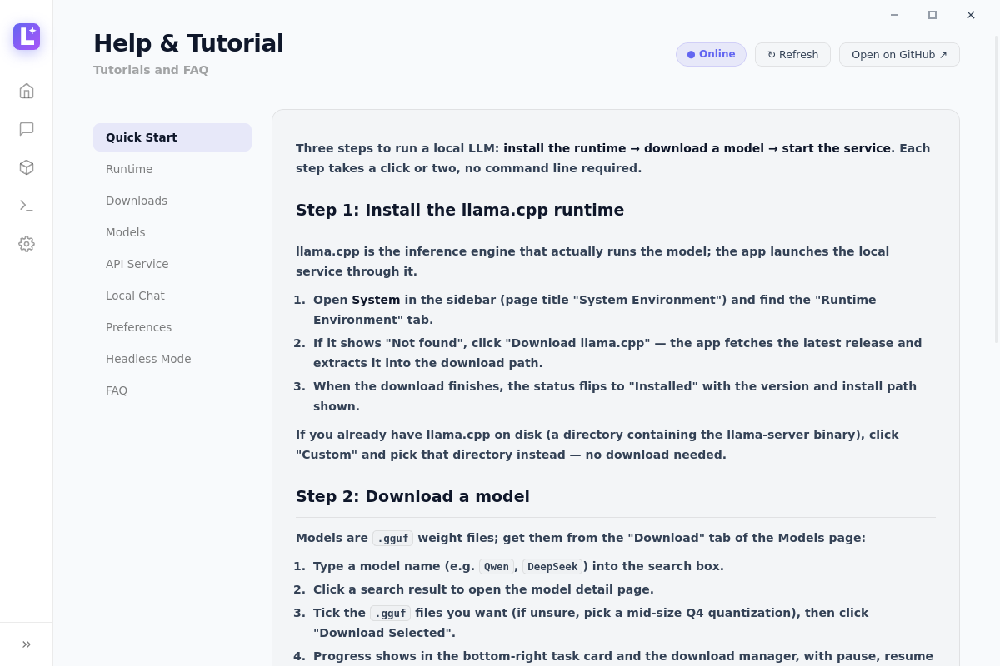
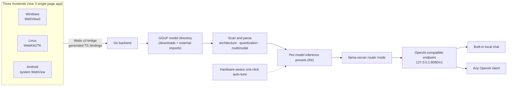

<div align="center">


# MyLlama

**A cross-platform GUI client for local LLM inference, built on [llama.cpp](https://github.com/ggml-org/llama.cpp)** — visually tune GGUF models, serve many models behind one OpenAI-compatible endpoint, with built-in model downloads, local chat, and real-time monitoring. One codebase across Windows / Android / Linux.

Windows x64 · Android arm64 · Linux x64/arm64 · GPL-3.0

[](https://github.com/CodeNeow/llama-cpp-desktop/releases)
[](https://github.com/CodeNeow/llama-cpp-desktop/releases)
[](LICENSE)
[](https://github.com/CodeNeow/llama-cpp-desktop/actions)
[](https://go.dev/dl/)
[](https://wails.io/)
[](https://vuejs.org/)

</div>

[简体中文](README.md)

<div align="center">


*Local chat: streaming conversation straight to the local llama-server; the service auto-starts on demand*

</div>

## 🖥️ One Experience, Three Platforms

The same Go + Vue 3 codebase delivers a consistent UI and interaction model on all three platforms.

**Windows**

| System Environment | Models |
| :---: | :---: |
|  |  |

| API Router | Model Settings |
| :---: | :---: |
|  |  |

**Android**

| Home | Chat |
| :---: | :---: |
|  |  |

| Models | Settings |
| :---: | :---: |
|  |  |

**Linux**

| System Environment | Models |
| :---: | :---: |
|  |  |

| API Router | Preferences |
| :---: | :---: |
|  |  |

<div align="center">

| Help & Tutorial |
| :---: |
|  |

</div>

<div align="center">

The floating task dock at the bottom-right corner: download progress plus one-click unload for in-memory models, identical on desktop and phone.


</div>

## ✨ Highlights

- **One endpoint, many models** — runs llama-server in router mode (`--models-dir` / `--models-preset` / `--models-max`), serving every GGUF in your models directory over a single OpenAI-compatible API (default `http://127.0.0.1:8080/v1`).
- **On-demand loading & one-click unload** — models load into VRAM / memory only when first requested, no manual preloading; loaded models are listed in the task dock, each with a one-click unload button, so switching models never requires restarting the service.
- **One codebase, three platforms** — the same Go + Vue 3 code runs on Windows (WebView2), Linux (WebKitGTK) and Android (system WebView); the phone tier automatically switches to a bottom navigation bar with an adaptive layout, honoring system safe areas (notches / gesture bars).
- **Headless API-route mode (Windows)** — one toggle restarts the app as a background-only process (Go backend + system tray + llama-server, no GUI): across GUI ↔ headless switches the llama-server process is handed over seamlessly, inference never stops, the OpenAI API stays available, and the tray menu's "Show Main Window" brings the full UI back anytime.
- **Copy-paste model IDs** — the API `model` field is exactly the name shown in the UI (e.g. `Qwen3.6-29B-REAP-Opus-Reasoning-Distill-MTP-Q4_K_M`); copy it from the "My Models" tab of the Models page, the API Router or the Chat page and it just works.
- **Hardware-aware auto-tune** — reads real GGUF metrics (block count, GQA/MLA KV geometry, trained context, MoE expert ratio) and snapshots GPU/CPU/RAM to plan GPU layers, context length, threads and cache types per model in one click.
- **SoC-aware tuning (Android)** — detects Snapdragon / Dimensity SoC identities and big.LITTLE performance-core counts to cap threads on phones and plan the CPU / GPU split for MoE experts.
- **In-app self-update on Android** — new versions are downloaded in place and installed through a system PackageInstaller session, no manual uninstall / reinstall.
- **CUDA compatibility guidance** — the System Environment page compares GPU compute capability against the installed CUDA runtime and states the verdict outright; Blackwell cards are told they need CUDA 12.8+, so you never chase a mismatched runtime.
- **Built-in chat** — streaming conversations straight to the local endpoint: sending a message auto-starts the local service and loads the selected model on demand, no manual start; switching models unloads the previous one automatically. Markdown rendering, a live reasoning view, image attachments for multimodal models, and per-session sampling controls (temperature, top-p / top-k, repeat penalty, max tokens, system prompt).
- **Model discovery and downloads** — the "Download" tab of the Models page searches HF Mirror (hf-mirror.com), Hugging Face and ModelScope, expands repositories into file lists, and batch-downloads through a resumable queue (pause / resume / cancel) that survives restarts.
- **Per-model inference presets** — GPU layers, KV cache types, long-context RoPE settings, speculative decoding and more, persisted per model and written into the llama-server preset on save.
- **Live service monitor** — server log console plus prompt-processing / generation token-speed metrics, refreshed every second — all pinned in the viewport, no page scrolling.
- **Task dock** — a collapsible card floating at the bottom-right corner shows download progress at a glance (llama.cpp / model files / app updates) alongside the models currently loaded in memory, each with a one-click unload button.
- **Desktop & mobile niceties** — Windows system tray, light / dark themes, and a zh / en / auto UI language; both Windows and Android support in-app update checks.
- **Built-in bilingual docs** — the "Help & Tutorial" card at the top of Preferences opens a full zh / en tutorial whose content updates online — fresh documentation without upgrading the app.

## 🚀 Getting Started

### Windows

Grab `MyLlama-setup-*-windows-amd64.exe` from the [latest release](https://github.com/CodeNeow/llama-cpp-desktop/releases/latest) and double-click to install (the installer embeds the WebView2 Runtime bootstrapper and installs it automatically if missing). The app updates itself, so later versions need no manual reinstall.

Requirements: Windows 10 or later (x64).

### Android

Grab `MyLlama-*-android-arm64.apk` from the [latest release](https://github.com/CodeNeow/llama-cpp-desktop/releases/latest) (arm64 devices, Android 5.0+), and allow "install unknown apps" when prompted. "Preferences → Check for Updates" inside the app downloads new versions and hands them to the system installer; in-app self-update requires the installed and the new APK to share one signature (release APKs are signed with a stable key), so debug-signed local builds should uninstall the old version first.

### Linux

Releases ship `.deb` packages for Ubuntu 22.04 / 24.04: download `myllama_*_amd64.deb` and install it (`sudo apt install ./myllama_*_amd64.deb`); the GTK / WebKit runtime libraries are resolved automatically through package dependencies. Other distributions can build from source as described below.

### Build from source

- [Git](https://git-scm.com/), [Go](https://go.dev/dl/) 1.25+, [Node.js](https://nodejs.org/) 18+
- Wails v3 CLI (matching the v3 version in go.mod):

  ```bash
  go install github.com/wailsapp/wails/v3/cmd/wails3@v3.0.0-beta.16
  ```

- Platform dependencies:
  - **Windows**: WebView2 Runtime (usually preinstalled on Windows 10/11);
  - **Linux**: GTK4 and WebKitGTK 6.0 development packages, e.g. `sudo apt install libgtk-4-dev libwebkitgtk-6.0-dev pkg-config` (Debian/Ubuntu; the released `.deb` packages are built with the `-tags gtk3` variant, i.e. GTK3 + WebKit2GTK 4.1);
  - **Android**: JDK 17 plus the Android SDK / NDK (`sdkmanager "ndk;26.3.11579264" "platforms;android-35"`); see the android section of [Taskfile.yml](Taskfile.yml) and the [CI configuration](.github/workflows/ci.yml).

Clone and build:

```bash
git clone https://github.com/CodeNeow/llama-cpp-desktop.git
cd llama-cpp-desktop
wails3 task build            # Windows / Linux desktop build
wails3 task android:package  # Android arm64 APK (build the frontend first; output in build/bin/)
```

Dev mode (Go backend + Vite frontend with hot reload, dev server pinned to `http://localhost:5173`):

```bash
wails3 task dev
```

**First steps (same on all platforms):**

1. On **System Environment**, in the "Runtime Environment" tab, click "Download llama.cpp" to fetch the latest release from GitHub (resumable), or point the app at an existing llama.cpp directory.
2. On the **Models** page's "Download" tab, search HF Mirror, Hugging Face or ModelScope and download a GGUF file into the models directory (`LLM-Models/` by default); progress shows up in the task dock at the bottom-right corner.
3. Open **Local Chat**, pick the model, and just send a message — sending auto-starts the local service and loads the selected model on demand, no manual start needed.
4. To connect other OpenAI-compatible clients or manage the service by hand, click "Start Server" on the **API Router** page (default `127.0.0.1:8080`).

## 🧭 Usage

- **System Environment** — two tabs, "System Info" and "Runtime Environment": System Info detects CPU, memory, GPU and CUDA with live samples and flags CUDA compatibility for Blackwell GPUs; Runtime Environment shows the llama.cpp installation status (main program and CUDA runtime components) with one-click resumable download or a custom directory. The landing tab is chosen smartly: Runtime first when llama.cpp is missing, System Info once installed.
- **Local Chat** — streaming chat with markdown rendering and image attachments; when the service is stopped, sending a message auto-starts it and loads the selected model on demand (guided prompts when models or the runtime are missing), switching models unloads the previous one, and load / unload changes show up in the task dock in real time.
- **Models** — the "Download" tab: tri-source search (HF Mirror / Hugging Face / ModelScope, switchable in Preferences), file-level selection and a persistent, resumable download queue; the "My Models" tab: scans the models directory for GGUF files (architecture, quantization, multimodal / embedding detection) with one-click hardware-aware auto-tune; each model links to its settings page (basic / inference / memory / multi-GPU / long-context / advanced tabs).
- **API Router** — start / stop / restart llama-server, watch the server log and dual token-speed metrics, edit the port / max concurrent models / prompt cache, and see which models are currently loaded; the access scope and inference GPU are configured under Preferences.
- **Preferences** — theme, UI language (zh / en / auto), download source, download & import directories, server options such as access scope and the inference GPU, Windows tray toggle, API-route mode, and check for updates; the "Help & Tutorial" card opens the built-in tutorial.

## 🔌 API Access

Once the service is running, any OpenAI-compatible client can connect:

```bash
OPENAI_BASE_URL="http://127.0.0.1:8080/v1"
OPENAI_API_KEY="sk-any-placeholder"   # no auth by default; an optional API key can be set in Preferences
```

Set `model` to the name shown in the UI (for example `Qwen3.6-29B-REAP-Opus-Reasoning-Distill-MTP-Q4_K_M`) — the tags on the API Router page are copy-paste ready; llama-server loads and unloads models on demand. In-memory models can also be unloaded from the task dock.

## ⚙️ Configuration

Runtime settings are persisted to `llama-desktop-config.json`, whose location differs per platform (resolved centrally in `core/paths.go`):

- **Windows**: the process working directory (typically the install directory);
- **Linux**: the app-data directory `~/.config/llama-desktop/`;
- **Android**: the app-private data directory (`/data/data/<package>/files/`).

Key fields:

| Field | Meaning | Default |
| --- | --- | --- |
| `theme` | UI theme: `light` / `dark` | `light` |
| `language` | UI language: `zh` / `en` / `auto` (auto follows the OS locale) | `auto` |
| `downloadSource` | Default model source: `hf` (HF Mirror) / `huggingface` (official) / `modelscope` | `hf` |
| `trayEnabled` | System tray, closing the window minimizes to tray (Windows) | `true` |
| `sidebarCollapsed` | Whether the sidebar starts collapsed | `true` |
| `apiRouteMode` | API-route (headless) mode (Windows): on the next start the app runs as tray + llama-server only, no GUI | `false` |
| `serverConfig` | `accessMode` (`local` / `lan`), `host`, `port`, `maxModels`, `cacheRam` (MiB), `apiKey` (optional auth), `deviceId` (inference GPU pin) | `127.0.0.1:8080`, `maxModels` 1, `cacheRam` 8192, no auth, GPU auto |

Also stored: `llamaCppDownloadDir` / `modelDownloadDir` (download paths) and `llamaCppDir` / `modelDir` (imported external directories), `modelConfigs` (per-model inference parameters), `downloadTasks` (the download queue, recovered on restart) and `onboardingDismissed` (whether the home quick-start checklist was closed).

## 🏗️ Architecture



The frontend is a Vue 3 single-page app that talks to the Go backend through the Wails v3 bridge (TypeScript bindings generated at build time); the same frontend renders inside WebView2 on Windows, WebKitGTK on Linux and the system WebView on Android. The backend scans the model directories, parses GGUF metadata, generates per-model inference presets and launches llama-server. Running in router mode, llama-server serves every GGUF in the directory behind one OpenAI-compatible endpoint, loading and unloading models on demand — the built-in chat and any OpenAI client connect to that same endpoint.

## 🛠️ Development

Combined quality gate:

```bash
powershell -NoProfile -ExecutionPolicy Bypass -File .\scripts\check.ps1     # Windows
make check                                                                  # POSIX
```

The gate runs `go build` / `go test` / `gofmt` / `golangci-lint` on the backend and `npm run build` (vue-tsc + vite) on the frontend; the PowerShell script also runs the vitest suite (`npm test`). Backend tests live in `core/*_test.go` (standard library `testing`, including service-chain E2E against a real llama-server), frontend tests in `frontend/src/__tests__/`. See [AGENTS.md](AGENTS.md) and [CONTRIBUTING.md](CONTRIBUTING.md) for conventions, commit format and the collaboration workflow.

## ❓ FAQ

**The app reports it is already running at startup.**
The app enforces a single-instance mutex, so duplicate launches are blocked (the window also covers retries inside the headless → GUI handover window). Close any running MyLlama first (including tray-only background instances), then start it again.

**`wails3 task dev` reports the port is already in use.**
The Vite dev server binds `localhost:5173` (`VITE_PORT` in the Taskfile, overridable via the `WAILS_VITE_PORT` environment variable). End the process occupying it and retry.

**"Start" on the API Router page fails with "no models found".**
Startup scans the models directory and generates presets first, so an empty directory is an error. Put GGUF files into `LLM-Models/` (check the "My Models" tab of the Models page) and try again. Also confirm llama.cpp is installed, as shown in the "Runtime Environment" tab of the System Environment page.

**API calls fail with `model not found`.**
The `model` field must match the name shown in the UI exactly (the service matches case-sensitively). Copy-paste from the API Router model tags or the "My Models" tab of the Models page instead of typing it by hand.

**Every backend call fails when running the frontend with `npm run dev` standalone.**
The frontend calls the Go backend through Wails v3 bindings generated at build time; Vite without `wails3 task dev` has no bridge to the backend, so calls fail at the request stage — this is expected. Use `wails3 task dev` to debug the UI with the backend attached.

**The Linux source build fails with missing GTK / WebKit dependencies.**
The Wails v3 Linux build goes through cgo: the default path needs the GTK4 and WebKitGTK 6.0 development packages (`libgtk-4-dev`, `libwebkitgtk-6.0-dev`), while the `-tags gtk3` variant needs `libgtk-3-dev` and `libwebkit2gtk-4.1-dev`. Install the packages matching your build variant — plus `pkg-config` — via your package manager and build again.

**Android install or in-app update fails.**
Installing the APK requires allowing "install unknown apps". In-app self-update requires the installed version and the new APK to share one signature — release APKs are signed with a stable key, while debug-signed local builds or APKs from other sources cannot upgrade each other; when signatures differ, uninstall the old version first. The app is sideload-only (not on any app store) and always fetches updates from GitHub Releases.

**Downloading llama.cpp is slow or fails.**
The download comes from GitHub Releases; it supports pause / resume with resumable transfers. On a restricted network, download the release package for your platform manually, extract it, and select the directory via "Custom" in the "Runtime Environment" tab of the System Environment page.

## 📄 License

Copyright © 2026 [CodeNeow](https://github.com/CodeNeow/llama-cpp-desktop)

This project is licensed under the [GNU General Public License v3](LICENSE).
