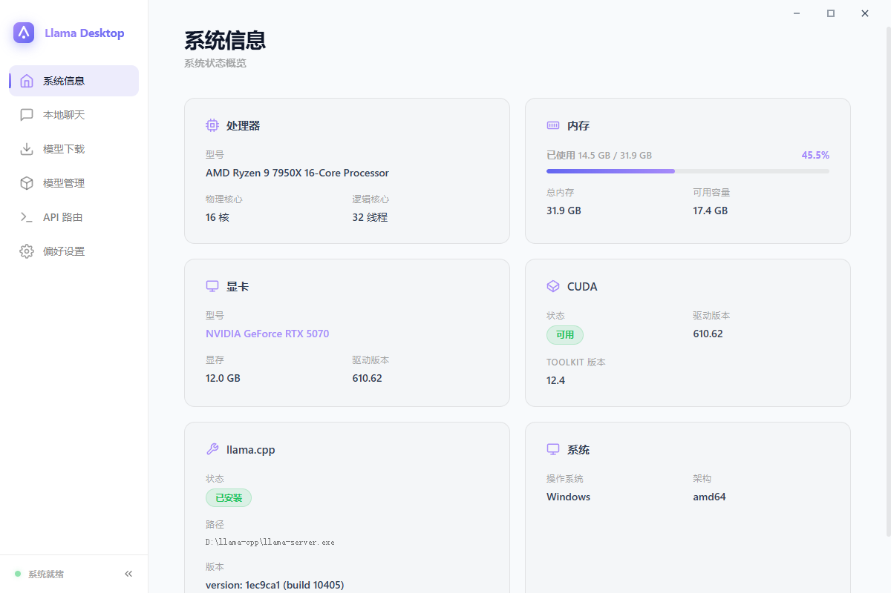
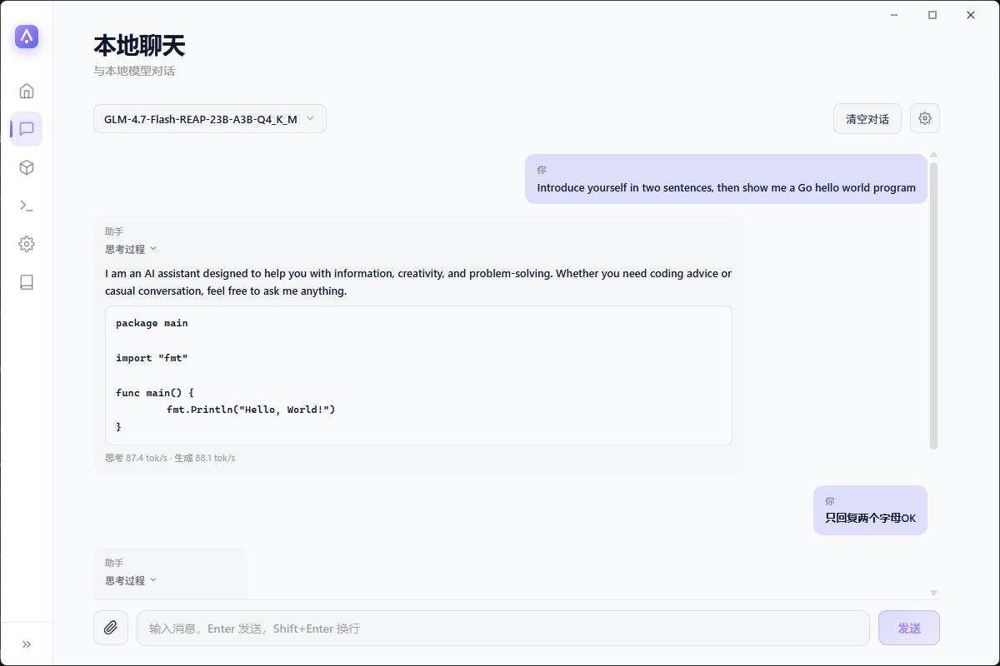
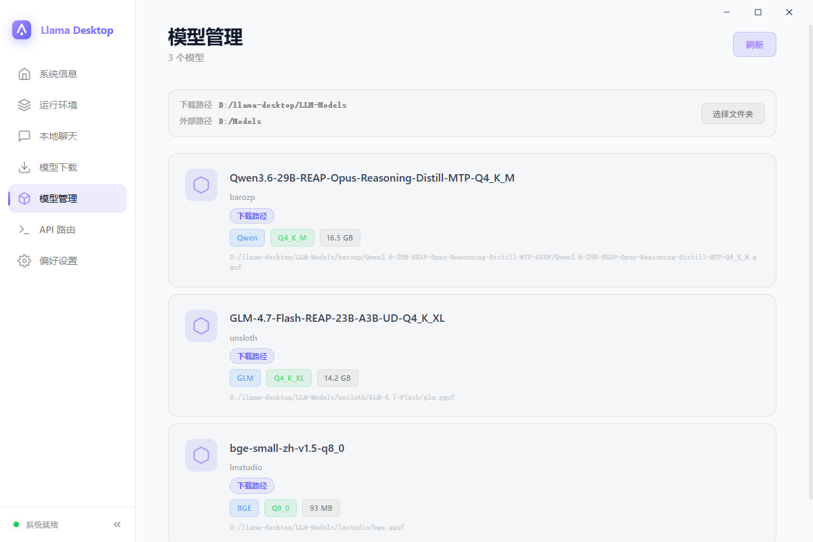
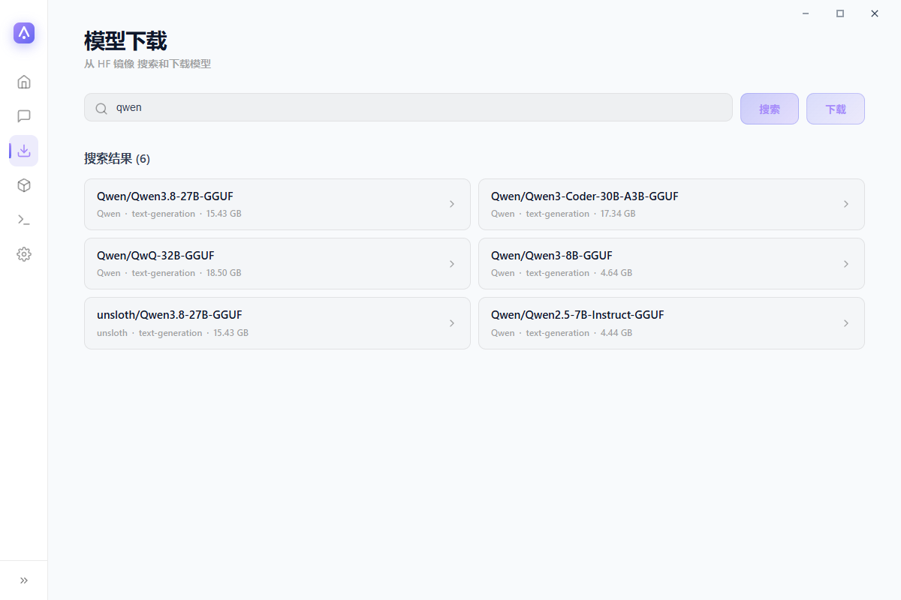
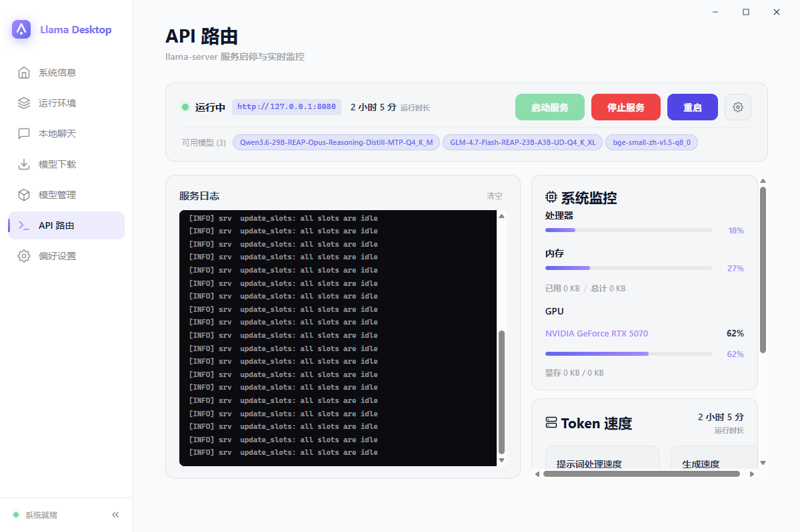
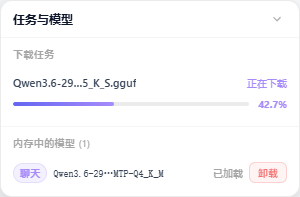
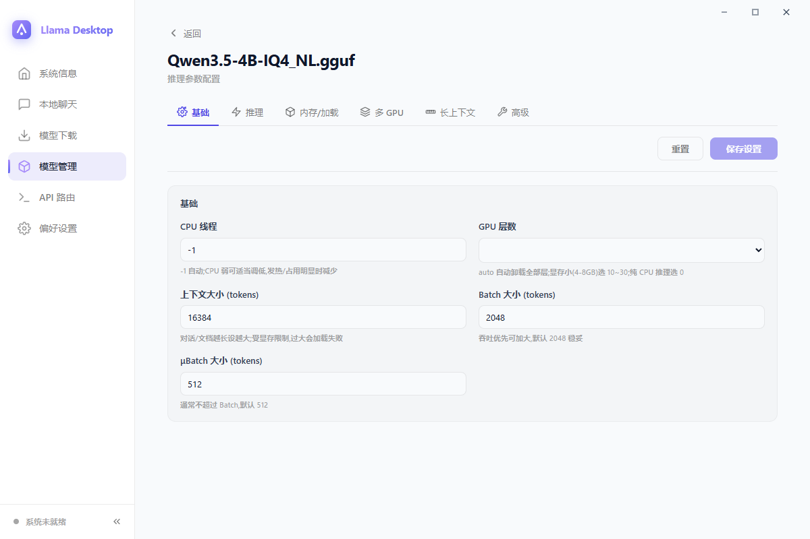

# Llama Desktop

[English](README.md)

[](https://github.com/CodeNeow/llama-cpp-desktop/releases)
[](LICENSE)
[](https://github.com/CodeNeow/llama-cpp-desktop/releases)
[](https://github.com/CodeNeow/llama-cpp-desktop/actions)

一个友好的 [llama.cpp](https://github.com/ggml-org/llama.cpp) 桌面图形客户端 —— 可视化配置 Qwen3.8-27B 等最新 GGUF 模型，多模型共享一个 OpenAI 兼容端点，内置模型下载、本地聊天与实时监控。基于 Wails v2（Go 后端 + Vue 3 前端，无第三方 UI 框架）。

## 功能亮点

- **一个端点，多个模型** — 以路由器模式运行 llama-server（`--models-dir` / `--models-preset` / `--models-max`），把模型目录下的所有 GGUF 汇聚到一个 OpenAI 兼容 API（默认 `http://127.0.0.1:8080/v1`），模型按需加载 / 卸载。
- **内置本地聊天** — 直连本地端点的流式对话，多模态模型支持发送图片，会话级采样参数可调（temperature、top-p / top-k、重复惩罚、最大 token 数、系统提示词）。
- **模型搜索与下载** — 支持 HF Mirror（hf-mirror.com）与 ModelScope 双源搜索，仓库可展开为文件列表，批量下载走可断点续传的任务队列（暂停 / 继续 / 取消），队列重启后自动恢复。
- **逐模型推理预设** — GPU 层数、KV 缓存类型、长上下文 RoPE、投机解码等参数按模型独立保存，保存后自动写入 llama-server 预设。
- **实时服务监控** — 服务日志控制台、提示词处理与生成速度双指标及折线图、CPU / 内存 / GPU（利用率 + 显存）采样，每秒刷新。
- **灵动任务卡片** — 右下角悬浮的可收起卡片，一眼看清下载进度（llama.cpp / 模型文件 / 应用更新），同时列出当前内存中已加载的模型，每个模型带一键卸载按钮。
- **桌面体验** — Windows 系统托盘、无头 API 路由模式（仅托盘 + llama-server 后台服务）、应用内检查更新、深色 / 浅色主题、界面语言支持 zh / en / auto。

## 界面预览



| 本地聊天 | 模型管理 |
| :---: | :---: |
|  |  |
|  |  |
|  |  |

## 快速开始

### 环境要求

- Windows 10+ 或 Ubuntu 20.04+（仅 x64/amd64 —— llama.cpp 官方不发布 32 位 Windows 构建；Windows 下 WebView2 随应用自动安装）
- [Git](https://git-scm.com/)、[Go](https://go.dev/dl/) 1.25+、[Node.js](https://nodejs.org/) 18+
- Wails CLI v2.14+：

  ```bash
  go install github.com/wailsapp/wails/v2/cmd/wails@latest
  ```

### 开发模式

```bash
git clone https://github.com/CodeNeow/llama-cpp-desktop.git
cd llama-cpp-desktop
wails dev
```

`wails dev` 会同时启动 Go 后端与 Vite 前端开发服务器（`http://localhost:5173`），前后端均支持热重载。

### 首次运行

1. 在**运行环境**页点击「下载 llama.cpp」从 GitHub 获取最新版（支持断点续传），也可指定已有的 llama.cpp 目录。
2. 在**模型下载**页搜索 HF Mirror 或 ModelScope，将 GGUF 文件下载到模型目录（默认 `LLM-Models/`）；进度显示在右下角任务卡片中。
3. 在**API 路由**页确认 Host / Port（默认 `127.0.0.1:8080`），点击「启动」。
4. 打开**本地聊天**页选择模型即可对话，也可以让任意 OpenAI 兼容客户端接入该端点。

## 使用指南

- **系统信息** — 自动检测 CPU、内存、GPU 与 CUDA 环境。
- **运行环境** — 展示 llama.cpp 安装状态（主程序与 CUDA 运行时组件）；支持一键断点续传下载或自定义目录。
- **本地聊天** — 流式聊天，支持图片附件与采样参数；需要 API 路由服务处于运行状态。
- **模型下载** — 双源搜索（HF Mirror / ModelScope，可在偏好设置中切换默认源），文件级选择，持久化的可断点续传下载队列。
- **模型管理** — 扫描模型目录下的 GGUF 文件（解析架构、量化等级，识别多模态 / 嵌入模型），每个模型可进入设置页（基础 / 推理 / 内存 / 多 GPU / 长上下文 / 高级六个标签页）。
- **API 路由** — 启动 / 停止 / 重启 llama-server，查看日志与实时监控，配置 Host / Port / 访问范围 / 最大并发模型数 / Prompt 缓存，并查看当前内存中的模型。
- **偏好设置** — 主题、界面语言（zh / en / auto）、下载源、Windows 托盘开关、检查更新。

服务启动后，任意 OpenAI 兼容客户端均可接入：

```bash
OPENAI_BASE_URL="http://127.0.0.1:8080/v1"
OPENAI_API_KEY="sk-任意占位值"   # 本地服务不做鉴权
```

`model` 字段直接填 GGUF 文件名（如 `qwen2.5-7b-instruct-q4_k_m.gguf`），llama-server 会自动加载 / 卸载模型；内存中的模型也可以在任务卡片中手动卸载。

## 配置

运行时配置持久化在项目根目录的 `llama-desktop-config.json`，主要字段：

| 字段 | 含义 | 默认值 |
| --- | --- | --- |
| `theme` | 主题：`light` / `dark` | `light` |
| `language` | 界面语言：`zh` / `en` / `auto`（auto 跟随系统语言） | `auto` |
| `downloadSource` | 默认下载源：`hf` / `modelscope` | `hf` |
| `trayEnabled` | Windows 系统托盘（显示主窗口 / 退出菜单） | `true` |
| `sidebarCollapsed` | 侧边栏是否默认收起 | `true` |
| `apiRouteMode` | API 路由（无头）模式：下次启动后仅以托盘 + llama-server 后台运行，不显示界面（Windows） | `false` |
| `serverConfig` | `accessMode`（`local` / `lan`）、`host`、`port`、`maxModels`、`cacheRam`（MiB） | `127.0.0.1:8080`，`maxModels` 1，`cacheRam` 8192 |

此外还保存：`llamaCppDownloadDir` / `modelDownloadDir`（下载路径）与 `llamaCppDir` / `modelDir`（外部导入目录）、`modelConfigs`（逐模型推理参数）、`downloadTasks`（下载任务队列，重启后恢复）。

## 开发

组合质量门禁：

```bash
make check                                                                  # POSIX
powershell -NoProfile -ExecutionPolicy Bypass -File .\scripts\check.ps1     # Windows
```

门禁会运行后端的 `go build` / `go test` / `gofmt` / `golangci-lint` 与前端的 `npm run build`（vue-tsc + vite）；PowerShell 脚本还会运行 vitest 测试套件（`npm test`）。后端测试位于 `core/*_test.go`（标准库 `testing`），前端测试位于 `frontend/src/__tests__/`。开发约定、提交格式与协作流程详见 [AGENTS.md](AGENTS.md) 与 [CONTRIBUTING.md](CONTRIBUTING.md)。

## 构建

```bash
wails build
```

生产构建产物输出到 `build/bin/llama-desktop.exe`（Windows）或 `build/bin/llama-desktop`（Linux）。前端通过 `go:embed` 打进二进制，`wails build` 会自动完成前端编译。

## 常见问题

**`wails dev` 提示端口被占用。**
Vite 开发服务器绑定 `localhost:5173`（见 `wails.json` 的 `frontend:dev:serverUrl`）。请结束占用该端口的进程后重试。

**API 路由页「启动」失败，提示找不到模型。**
启动流程会先扫描模型目录并生成预设，目录为空时会报错。请先将 GGUF 文件放入 `LLM-Models/`（可在模型管理页确认），然后重试；同时请在运行环境页确认 llama.cpp 已安装。

**单独运行 `npm run dev` 时所有后端调用都报错。**
`window.go` 由 Wails 运行时注入，脱离 `wails dev` 的 Vite 没有通往 Go 后端的桥接层，这是预期行为。调试 UI 请使用 `wails dev`。

**下载 llama.cpp 很慢或失败。**
下载源为 GitHub Releases，支持暂停 / 继续与断点续传。网络受限时可手动下载对应平台发行包并解压，然后在运行环境页通过「自定义」选择该目录。

## 协议

本项目基于 [MIT License](LICENSE) 开源。
